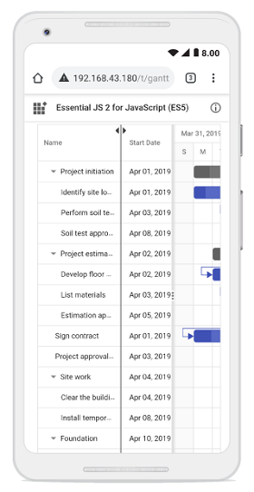

# Column Resizing with Dynamic Width Adjustment in Angular Gantt Chart

The [Angular Gantt Chart](https://www.syncfusion.com/angular-components/angular-gantt-chart) component enables dynamic column resizing by dragging column header edges. This feature enhances readability and layout flexibility, especially when working with large datasets.  To enable this feature, set the [allowResizing](https://ej2.syncfusion.com/angular/documentation/api/gantt#allowresizing) property to **true** in the Gantt configuration. 

Column width can be adjusted by dragging the right edge of the header, with changes applied immediately.  

To use the column resize feature, inject `ResizeService` in the `providers` array of the component. The service enables the drag-and-drop resize functionality at runtime.  












  


>* You can disable resizing for a particular column, by specifying [columns.allowResizing](https://ej2.syncfusion.com/angular/documentation/api/gantt/columnDirective#allowresizing) to **false**.
>* In RTL mode, you can click and drag the left edge of header cell to resize the column.
>* The [width](https://ej2.syncfusion.com/angular/documentation/api/gantt/columnDirective#width) property of the column can be set initially to define the default width of the column. However, when column resizing is enabled, you can override the default width by manually resizing the columns.

## Restrict the resizing based on minimum and maximum width

The Angular Gantt Chart component allows restricting column resizing within a defined range to maintain layout consistency. This ensures column widths remain within the specified limits during resizing.  
  
To enable this, set the [minWidth](https://ej2.syncfusion.com/angular/documentation/api/gantt/columnDirective#minwidth) and [maxWidth](https://ej2.syncfusion.com/angular/documentation/api/gantt/columnDirective#maxwidth) properties in the column configuration.  

The following example demonstrates how the **TaskID** column can be configured with a minimum width of 100 pixels and a maximum of 200 pixels, while the **TaskName** column can be set between 150 and 300 pixels.  












  


## Prevent resizing for particular column

You can prevent resizing for a specific column in the Angular Gantt Chart component to maintain a consistent column width. To disable resizing, set the [allowResizing](https://ej2.syncfusion.com/angular/documentation/api/gantt/columnDirective#allowresizing) property of the respective column to **false**.  

The following example demonstrates how to disable resizing for the **TaskID** column.












  


> You can also prevent resizing by setting `args.cancel` to **true** in the [resizeStart](https://ej2.syncfusion.com/angular/documentation/api/gantt#resizestart) event.

## Column resizing modes

The Angular Gantt Chart component supports two resizing modes that determine how column widths behave during resizing. These modes are configured using the [resizeSettings.mode](https://ej2.syncfusion.com/angular/documentation/api/grid/resizeSettings#mode) property (values: **'Normal'** | **'Auto'**) of the underlying TreeGrid during the component's `load` event or through direct property assignment.

**Available resizing modes:**

1. **Normal mode** (`mode: 'Normal'`): Columns retain their defined widths. If the total column width is less than the Angular Gantt Chart width, empty space appears to the right. If it exceeds, a horizontal scrollbar is shown.  
2. **Auto mode** (`mode: 'Auto'`): Columns automatically expand or contract to fill the available space based on the Angular Gantt Chart width.

To apply a resizing mode, set the `resizeSettings.mode` property on the `grid` object inside the Angular Gantt Chart instance. This can be done during the `load` event or dynamically based on user interaction.  

The following example demonstrates how to set the `resizeSettings.mode` to **Normal** or **Auto** based on the `DropDownList` [change](https://ej2.syncfusion.com/angular/documentation/api/drop-down-list#change) event.












  


> When the [autoFit](https://ej2.syncfusion.com/angular/documentation/api/grid#autofit) property of grid object in Angular Gantt Chart instance is set to **true**, the Angular Gantt Chart will automatically adjust its column width based on the content inside them. In `normal` resize mode, if the `autoFit` property is set to **true**, the Angular Gantt Chart will maintain any empty space that is left over after resizing the columns. However, in `auto` resize mode, the Angular Gantt Chart will ignore any empty space.

## Resize columns programmatically

You can programmatically resize columns in the Angular Gantt Chart component by accessing the target column using the `getColumnByField` method and updating its [width](https://ej2.syncfusion.com/angular/documentation/api/gantt/columnDirective#width) property. This is useful for implementing custom UI controls or dynamic layout adjustments.  To reflect the change, call the `refreshColumns` method from the `treeGrid` object within the Gantt instance.

The following example demonstrates how to resize a column externally using the [change](https://ej2.syncfusion.com/angular/documentation/api/drop-down-list#change) event of the [DropDownList](https://ej2.syncfusion.com/angular/documentation/drop-down-list/getting-started) component. 












  


>  The `refreshColumns` method of `treeGrid` object in Angular Gantt Chart instance is used to refresh the Angular Gantt Chart after the column widths are updated. Column resizing externally is useful when you want to provide a custom interface to the user for resizing columns.

## Customize column resizing behavior using events

You can control column resizing using [resizeStart](https://ej2.syncfusion.com/angular/documentation/gantt/events#resizestart), [resizing](https://ej2.syncfusion.com/angular/documentation/gantt/events#resizing), and [resizeStop](https://ej2.syncfusion.com/angular/documentation/gantt/events#resizestop) events. Each event fires at a different stage of the resize operation, allowing you to customize behavior for different columns.

The following example demonstrates how to handle each resizing event separately in their respective event handlers:
- **resizeStart** event handler: Cancels resizing for the **TaskID** column by setting `args.cancel = true`.
- **resizing** event handler: Prevents width changes for the **Duration** column during the resize operation.
- **resizeStop** event handler: Applies custom CSS styles to the **TaskName** column after resizing completes.












  


>The `ResizeArgs` object passed to the events contains information such as the current column width, new column width, column index, and the original event. The [resizing](https://ej2.syncfusion.com/angular/documentation/api/gantt#resizing) event is triggered multiple times during a single resize operation, so be careful when performing heavy operations in this event.

## Touch interaction

The Angular Gantt Chart component automatically supports touch interactions for mobile devices when [allowResizing](https://ej2.syncfusion.com/angular/documentation/api/gantt#allowresizing) is enabled.

**Resizing columns on touch devices:**

To resize a column on a touch-enabled device:

1. Tap and hold on the right edge of the column header to activate the resize mode.
2. A floating handler appears over the column border, indicating the resize is active.
3. Drag the handler left or right to adjust the column width.
4. Release your finger to apply the new width.

**Note:** Touch resizing works the same as desktop drag-and-drop. The column menu's AutoFit option is also available on touch devices for quick width adjustments.

The screenshot below illustrates column resizing on a touch device.

