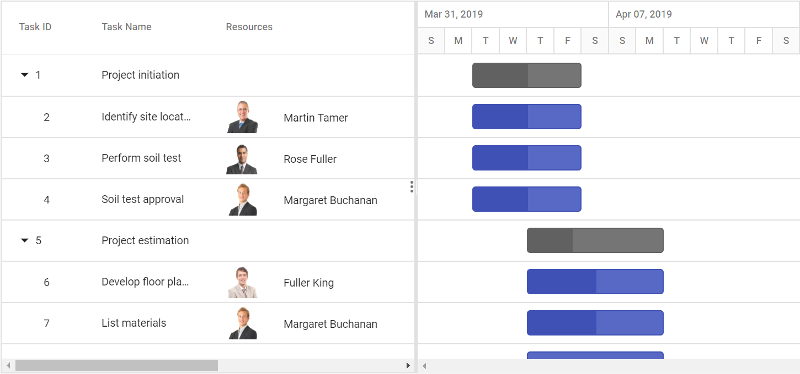

# Column Templates with Custom Cell Content in ASP.NET Core Gantt Chart

A column template is used to customize the column’s look. The following code example explains how to define the custom template in Gantt using the [`Template`](https://help.syncfusion.com/cr/aspnetcore-js2/Syncfusion.EJ2.Gantt.GanttColumn.html#Syncfusion_EJ2_Gantt_GanttColumn_Template) property.










