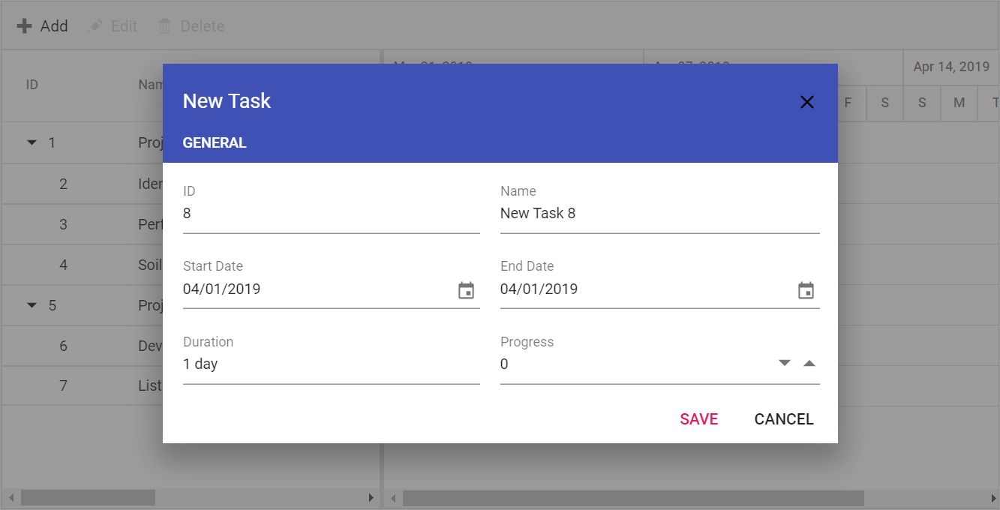
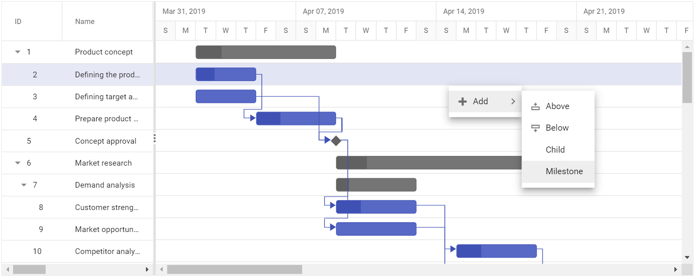
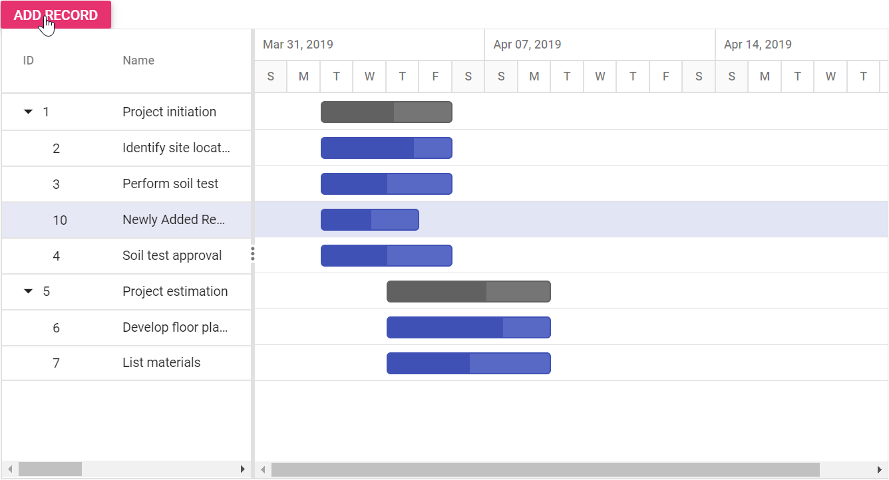

# Adding New Tasks in ASP.NET Core Gantt Chart

Tasks can be dynamically added to the Gantt project by enabling the [`EditSettings.AllowAdding`](https://help.syncfusion.com/cr/aspnetcore-js2/Syncfusion.EJ2.Gantt.GanttEditSettings.html#Syncfusion_EJ2_Gantt_GanttEditSettings_AllowAdding) property.

## Toolbar

A row can be added to the Gantt component from the toolbar while the [`EditSettings.AllowAdding`](https://help.syncfusion.com/cr/aspnetcore-js2/Syncfusion.EJ2.Gantt.GanttEditSettings.html#Syncfusion_EJ2_Gantt_GanttEditSettings_AllowAdding) property is set to true. On clicking the toolbar add icon, you should provide the task information in the add dialog.










N> By default, the new row will be added to the top most row in the Gantt control.

## Context menu

A row can also be added above, below or child of the selected row by using context menu support. For this, we need to enable the property [`enableContextMenu`](https://help.syncfusion.com/cr/aspnetcore-js2/Syncfusion.EJ2.Gantt.Gantt.html#Syncfusion_EJ2_Gantt_Gantt_EnableContextMenu) and inject the `ContextMenu` module into the Gantt control.










## Using method

You can add rows to the Gantt control dynamically using the `addRecord` method and you can define the add position of the default new record by using the [`RowPosition`](https://help.syncfusion.com/cr/aspnetcore-js2/Syncfusion.EJ2.Gantt.RowPosition.html) property. You can also pass the `RowIndex` as an additional parameter.

* Top of all the rows.
* Bottom to all the existing rows.
* Above the selected row.
* Below the selected row.
* As child to the selected row.










