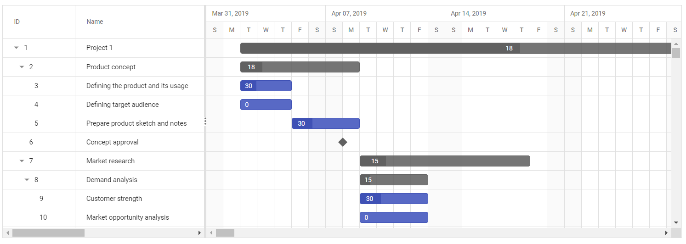

# Implementing Virtual Scrolling in ASP.NET Core Gantt Chart

Virtual Scroll support in Gantt allows you to load large amount of data without performance degradation. To enable Virtual Scrolling, you need to inject `VirtualScroll` module in Gantt.

## Row virtualization

Row virtualization allows you to load and render a large number of tasks in Gantt with effective performance. In this mode, all tasks are fetched initially from the datasource and rendered in the DOM within a compact viewport area.

The number of records displayed in the Gantt is determined by the height.

This mode can be enable by setting the `EnableVirtualization` property to `true`.
























## Timeline virtualization

Timeline virtualization allows you to load a data source having large timespan with high performance. Initially, it renders the timeline with thrice the width of the gantt element, while other timeline cells render on-demand during horizontal scrolling.

This mode can be enable by setting the [EnableTimelineVirtualization](https://help.syncfusion.com/cr/aspnetcore-js2/Syncfusion.EJ2.Gantt.Gantt.html#Syncfusion_EJ2_Gantt_Gantt_EnableTimelineVirtualization) property to `true`.
























## Limitations for virtual scroll

* Due to the element height limitation in browsers, the maximum number of records loaded is limited by the browser capacity.
* Cell-based selection is not supported when virtualization is enabled.
* The number of records rendered will be determined by the `Height` property.
* It is necessary to mention the height of the Gantt in pixels when enabling Virtual Scrolling.