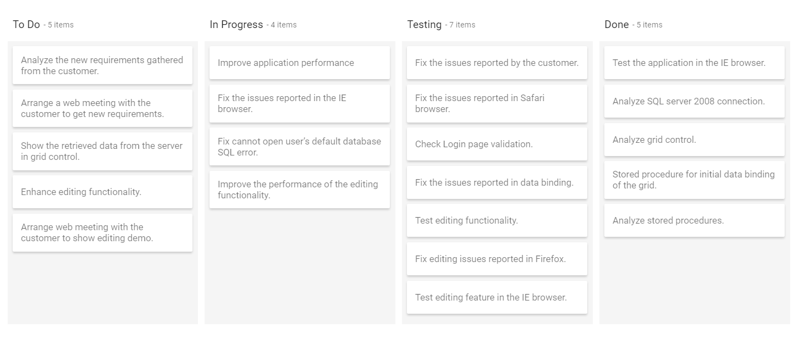
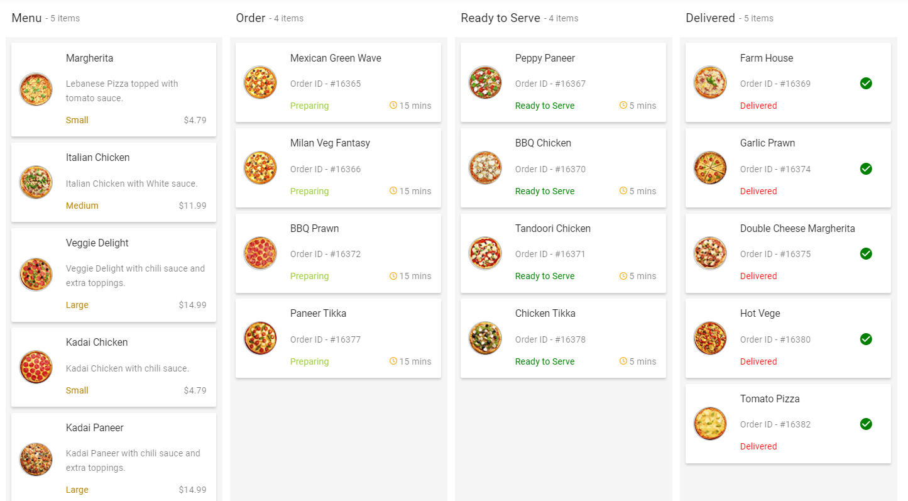
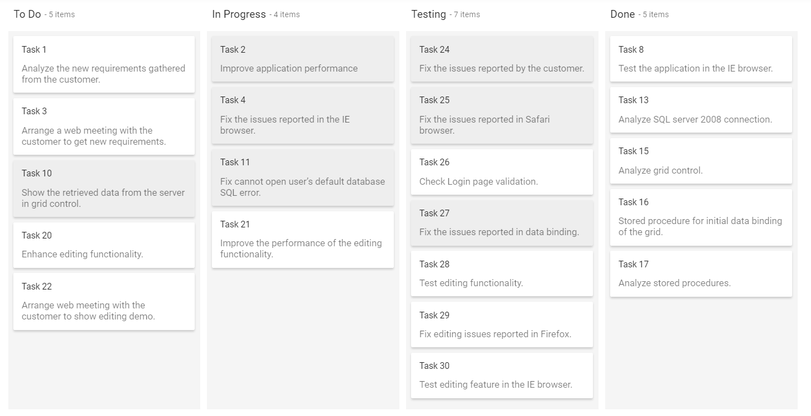

# Cards Customization and Layout Options in ASP.NET Core Kanban

The cards are main elements in Kanban board, which represent the task information with header and content. The header and content of a card is fetched from the corresponding mapping fields. The card layout can be customized with template also.

## Drag-and-drop

Transit or change the card position using the drag-and-drop functionality. By default, the [`allowDragAndDrop`](https://help.syncfusion.com/cr/aspnetcore-js2/Syncfusion.EJ2.Kanban.Kanban.html#Syncfusion_EJ2_Kanban_Kanban_AllowDragAndDrop) property is enabled on the Kanban board, which is used to change the card position by column-to-column or within the column.

Added dotted border on Kanban cells except the dragged clone cells when dragging, which indicates the possible ways for dropping the cards into the cells.

## Header

The card header is achieved by mapping the [`headerField`](https://help.syncfusion.com/cr/aspnetcore-js2/Syncfusion.EJ2.Kanban.KanbanCardSettings.html#Syncfusion_EJ2_Kanban_KanbanCardSettings_HeaderField) property, which is placed inside the [`cardSettings`](https://help.syncfusion.com/cr/aspnetcore-js2/Syncfusion.EJ2.Kanban.Kanban.html#Syncfusion_EJ2_Kanban_Kanban_CardSettings) property. By default, the [`showHeader`](https://help.syncfusion.com/cr/aspnetcore-js2/Syncfusion.EJ2.Kanban.KanbanCardSettings.html#Syncfusion_EJ2_Kanban_KanbanCardSettings_ShowHeader) property enabled by Kanban board that is used to show the header at the top of the card.

N> The [`headerField`](https://help.syncfusion.com/cr/aspnetcore-js2/Syncfusion.EJ2.Kanban.KanbanCardSettings.html#Syncfusion_EJ2_Kanban_KanbanCardSettings_HeaderField) property of [`cardSettings`](https://help.syncfusion.com/cr/aspnetcore-js2/Syncfusion.EJ2.Kanban.Kanban.html#Syncfusion_EJ2_Kanban_Kanban_CardSettings) is mandatory to render the cards in the Kanban board. It acts as a unique field that is used to avoid the duplication of card data. You can not change the [`headerField`](https://help.syncfusion.com/cr/aspnetcore-js2/Syncfusion.EJ2.Kanban.KanbanCardSettings.html#Syncfusion_EJ2_Kanban_KanbanCardSettings_HeaderField) of mapped data value using the `updateCard` public method or server-side update of data.

In the following demo, the [`showHeader`](https://help.syncfusion.com/cr/aspnetcore-js2/Syncfusion.EJ2.Kanban.KanbanCardSettings.html#Syncfusion_EJ2_Kanban_KanbanCardSettings_ShowHeader) property is disabled on Kanban board.










Output be like the below.

## Content

The card's content is fetched from data source using the [`contentField`](https://help.syncfusion.com/cr/aspnetcore-js2/Syncfusion.EJ2.Kanban.KanbanCardSettings.html#Syncfusion_EJ2_Kanban_KanbanCardSettings_ContentField) property, which is placed inside the [`cardSettings`](https://help.syncfusion.com/cr/aspnetcore-js2/Syncfusion.EJ2.Kanban.Kanban.html#Syncfusion_EJ2_Kanban_Kanban_CardSettings) property. If the [`contentField`](https://help.syncfusion.com/cr/aspnetcore-js2/Syncfusion.EJ2.Kanban.KanbanCardSettings.html#Syncfusion_EJ2_Kanban_KanbanCardSettings_ContentField) property is not used, card is rendered with empty content.

## Template

You can customize the default card layout using template as per your application needs. This can be achieved by template of the [`cardSettings`](https://help.syncfusion.com/cr/aspnetcore-js2/Syncfusion.EJ2.Kanban.Kanban.html#Syncfusion_EJ2_Kanban_Kanban_CardSettings) property.










Output be like the below.

## Selection

Kanban board allows to select single and multiple selection of cards when mouse or keyboard interactions using [`selectionType`](https://help.syncfusion.com/cr/aspnetcore-js2/Syncfusion.EJ2.Kanban.KanbanCardSettings.html#Syncfusion_EJ2_Kanban_KanbanCardSettings_SelectionType) property. The property contains following types.

* **None**: No cards are allowed to select from Kanban board.
* **Single**: Only one card allowed to select at a time in the Kanban board.
* **Multiple**: Multiple cards are allowed to select in a board.

### Multiple Selection

Select the multiple cards randomly using Ctrl + mouse click and select the multiple cards continuously using Shift + mouse click action on Kanban board. Set `Multiple` in [`selectionType`](https://help.syncfusion.com/cr/aspnetcore-js2/Syncfusion.EJ2.Kanban.KanbanCardSettings.html#Syncfusion_EJ2_Kanban_KanbanCardSettings_SelectionType) to enable the multiple selection in a board.










Output be like the below.

