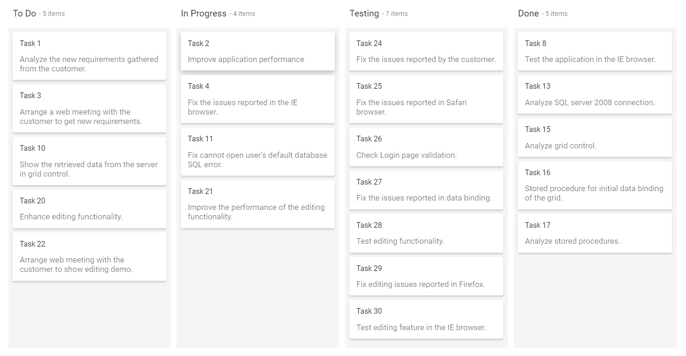
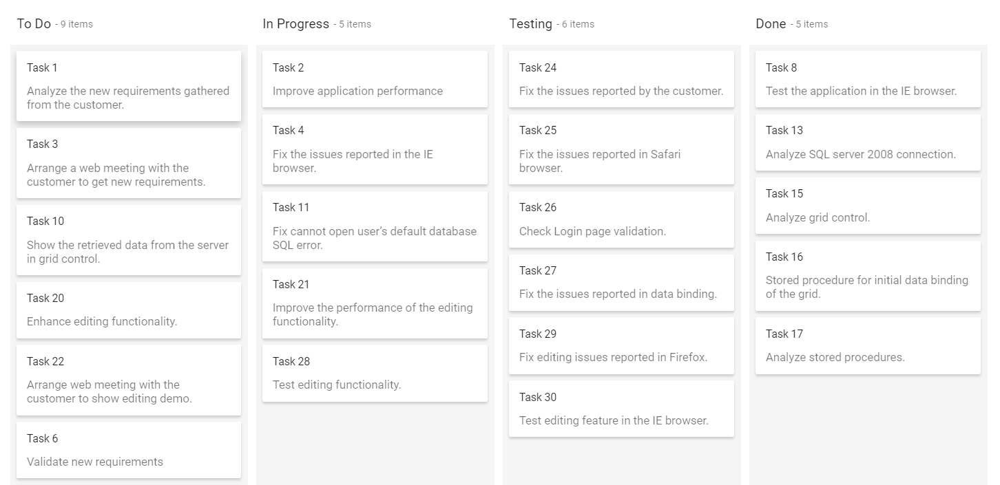
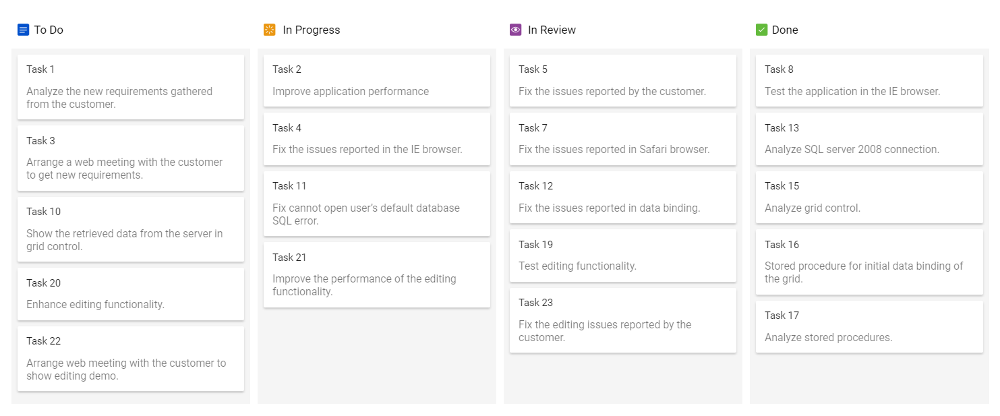
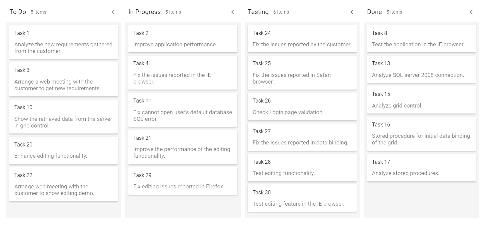
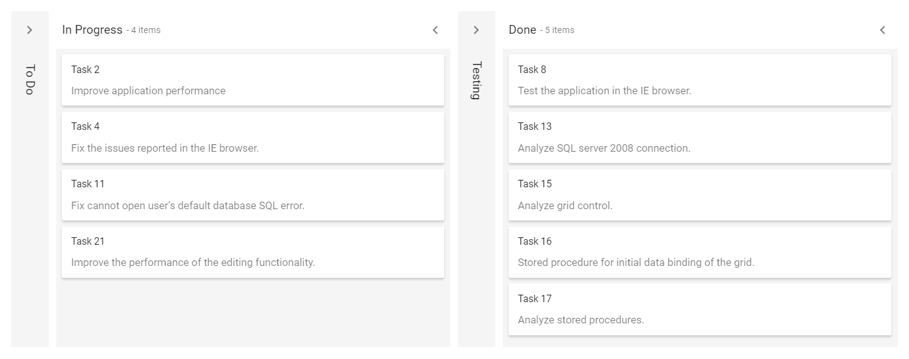
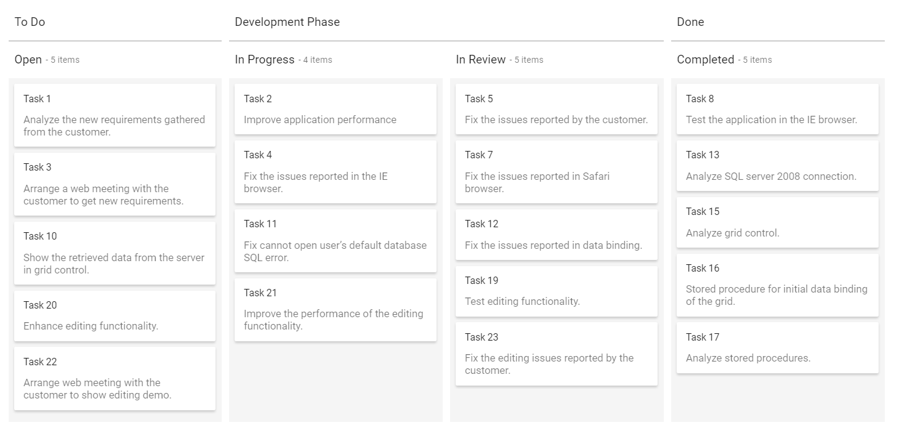

# Columns Configuration and Workflow Stages in ASP.NET Core Kanban

The **Kanban** columns represent the each stage of the process. The column definitions are used as the **dataSource** schema in the Kanban. The Kanban operations such as drag-and-drop, swimlane, and toggle columns are performed based on column definitions.

## Single-key mapping

Kanban columns are categorized by mapping the **key** from the datasource using the [`keyField`](https://help.syncfusion.com/cr/aspnetcore-js2/Syncfusion.EJ2.Kanban.Kanban.html#Syncfusion_EJ2_Kanban_Kanban_KeyField) property. The corresponding **value** in the datasource is mapped inside the columns [`keyField`](https://help.syncfusion.com/cr/aspnetcore-js2/Syncfusion.EJ2.Kanban.Kanban.html#Syncfusion_EJ2_Kanban_Kanban_KeyField).  Based on this categorization, Kanban columns are split on this board.

N> The [`keyField`](https://help.syncfusion.com/cr/aspnetcore-js2/Syncfusion.EJ2.Kanban.Kanban.html#Syncfusion_EJ2_Kanban_Kanban_KeyField) property is mandatory to render the columns in the Kanban board.










Output be like the below.

## Multi-key mapping

Kanban board allows to render a single column by mapping multiple keys using [`keyField`](https://help.syncfusion.com/cr/aspnetcore-js2/Syncfusion.EJ2.Kanban.Kanban.html#Syncfusion_EJ2_Kanban_Kanban_KeyField) property. In below sample, specified the multiple keys(Open, Validate) to a single column.










Output be like the below.

## Header text

You can provide the column header text of Kanban columns using the [`headerText`](https://help.syncfusion.com/cr/aspnetcore-js2/Syncfusion.EJ2.Kanban.KanbanColumn.html#Syncfusion_EJ2_Kanban_KanbanColumn_HeaderText) property. If you have not specified any header text, it will render the header without any text.

## Header template

You can customize the column header with any HTML or CSS element using the `template` property as shown in the following code.










Output be like the below.

## Toggle columns

Kanban allows to expand or collapse its columns using [`allowToggle`](https://help.syncfusion.com/cr/aspnetcore-js2/Syncfusion.EJ2.Kanban.KanbanColumn.html#Syncfusion_EJ2_Kanban_KanbanColumn_AllowToggle) inside the [`columns`](https://help.syncfusion.com/cr/aspnetcore-js2/Syncfusion.EJ2.Kanban.Kanban.html#Syncfusion_EJ2_Kanban_Kanban_Columns) property. When enable the property, it will render the expand or collapse icon to the column header.

N> By default, collapsed column width is set to `50px`.










Output be like the below.

### Initially collapsed column

By default, all columns are on expanded state when loading the Kanban board initially. But, you can render the columns with collapsed state using the [`isExpanded`](https://help.syncfusion.com/cr/aspnetcore-js2/Syncfusion.EJ2.Kanban.KanbanColumn.html#Syncfusion_EJ2_Kanban_KanbanColumn_IsExpanded) property.

N>The [`isExpanded`](https://help.syncfusion.com/cr/aspnetcore-js2/Syncfusion.EJ2.Kanban.KanbanColumn.html#Syncfusion_EJ2_Kanban_KanbanColumn_IsExpanded) property only works when enabling the [`allowToggle`](https://help.syncfusion.com/cr/aspnetcore-js2/Syncfusion.EJ2.Kanban.KanbanColumn.html#Syncfusion_EJ2_Kanban_KanbanColumn_AllowToggle) property on particular column.

In the following example, the To Do column is collapsed on initialization of Kanban board.










Output be like the below.

## Drag and Drop
 
The Kanban component allows dynamic column reordering through drag-and-drop interactions. To enable this, set the [`allowColumnDragAndDrop`] property to true. Once enabled, users can rearrange columns by dragging a column header to a new position, with visual feedback highlighting potential drop locations.
 









## Stacked headers

Stacked headers are the additional headers to column header that will group the similar columns.

Define the grouping of columns **Key** value to the `keyFields` property and provide the custom header text name to grouped columns using the `text` property, which is placed inside the [`stackedHeaders`](https://help.syncfusion.com/cr/aspnetcore-js2/Syncfusion.EJ2.Kanban.Kanban.html#Syncfusion_EJ2_Kanban_Kanban_StackedHeaders) property.

In the following code, the kanban columns 'InProgress, Review' are grouped under 'Development phase' category.










Output be like the below.

