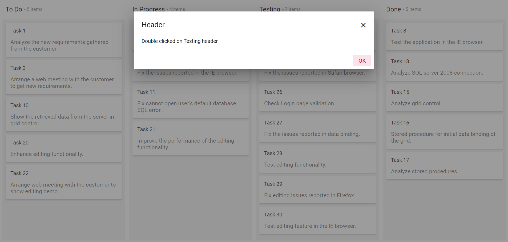

# Handle Header Double-Click in ASP.NET Core Kanban

You can bind the header double click event by using the `dataBound` event at the initial rendering. You can get the column header text when you double click on the headers.










Output be like the below.

