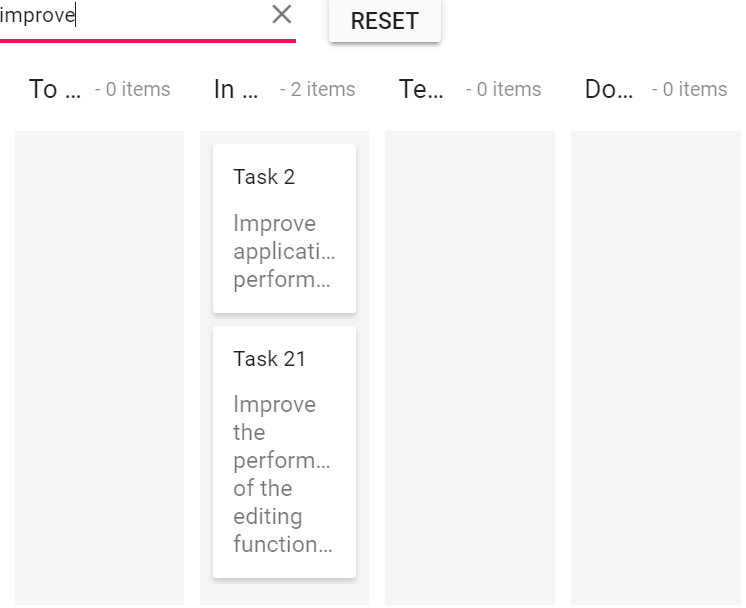

# Search Cards in ASP.NET Core Kanban

You can search the cards in Kanban by using the `query` property.

In the following sample, the searching operation starts as soon as you start typing characters in the external text box. It will search the cards based on the `Id` and `Summary` using the `search` query with `contains` operator.










Output be like the below.

