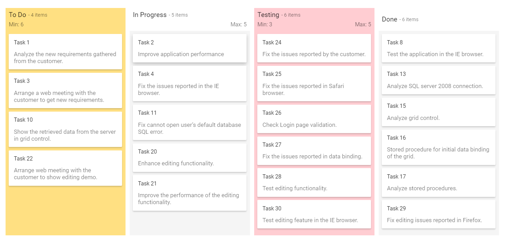

# WIP Validation and Work-in-Progress Limits in ASP.NET Core Kanban

Validate particular column using the `minCount` or `maxCount` properties. The corresponding columns gets different appearance when validation fails. In default layout, `constraintType` property accept only `column` type. In swimlane layout, accept both `column` and `swimlane` constraint type.

There are two types of constraints:

1. Column
2. Swimlane

N> By default, the column count validation is performed based on Kanban **Columns**.

## Minimum card limit

The `minCount` property is used to specify the minimum cards hold on particular column or swimlane cell. If the column or swimlane total card count falls short of the minimum count value, it shows the column or cell background color with validation fails.

## Maximum card limit

The `maxCount` property is used to specify the maximum cards hold on particular column or swimlane cell. If the column or swimlane cell total card count exceeds the maximum count value, it shows the column or cell background color with validation fails.










Output be like the below.

