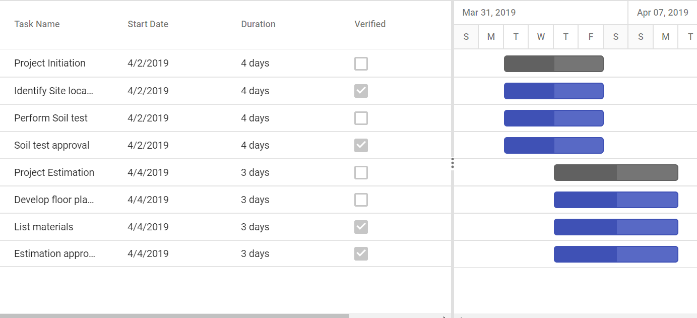

# Checkbox Columns in ASP.NET MVC Gantt Chart

To render boolean values as checkbox in columns, you need to set [displayAsCheckBox](https://help.syncfusion.com/cr/aspnetmvc-js2/Syncfusion.EJ2.Gantt.GanttColumn.html#Syncfusion_EJ2_Gantt_GanttColumn_DisplayAsCheckBox) property as **true**.










