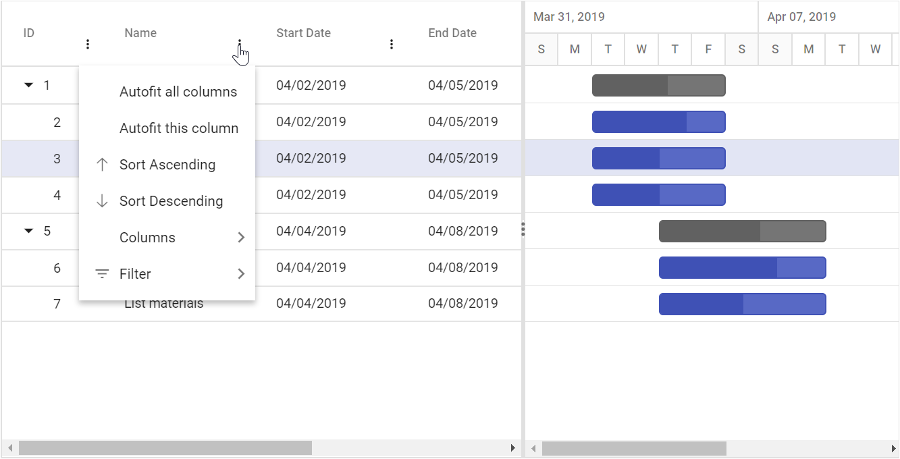

# Column Menu with Sort and Filter in ASP.NET MVC Gantt Chart

The column menu has options to integrate features like sorting, filtering, and autofit. It will show a menu with the integrated feature when users click the Multiple icon of the column. To enable the column menu, you should set the [`ShowColumnMenu`](https://help.syncfusion.com/cr/aspnetmvc-js2/Syncfusion.EJ2.Gantt.Gantt.html#Syncfusion_EJ2_Gantt_Gantt_ShowColumnMenu) property to true. The default items are displayed in the following table:

| Item             | Description                                                            |
| ---------------- | ---------------------------------------------------------------------- |
| `SortAscending`  | Sort the current column in ascending order.                            |
| `SortDescending` | Sort the current column in descending order.                           |
| `AutoFit`        | Auto fit the current column.                                           |
| `AutoFitAll`     | Auto fit all columns.                                                  |
| `Filter`         | Show the filter option as given in the `filterSettings.type` property. |










N> You can disable the column menu for a particular column by setting the `Columns.ShowColumnMenu` to `false`.

## Column menu Events

During the resizing action, the gantt component triggers the below two events.

1. The [`columnMenuOpen`](https://help.syncfusion.com/cr/aspnetmvc-js2/Syncfusion.EJ2.Gantt.Gantt.html#Syncfusion_EJ2_Gantt_Gantt_ColumnMenuOpen) event triggers before the column menu opens.
2. The [`columnMenuClick`](https://help.syncfusion.com/cr/aspnetmvc-js2/Syncfusion.EJ2.Gantt.Gantt.html#Syncfusion_EJ2_Gantt_Gantt_ColumnMenuClick) event triggers when the user clicks the column menu of the gantt.










## Custom Column Menu Item

Custom column menu items can be added by defining the `columnMenuItems`. Actions for this customized items can be defined in the [`columnMenuClick`](https://help.syncfusion.com/cr/aspnetmvc-js2/Syncfusion.EJ2.Gantt.Gantt.html#Syncfusion_EJ2_Gantt_Gantt_ColumnMenuClick) event.










## Customize menu items for particular columns

Sometimes, you have a scenario that to hide an item from column menu for particular columns. In that case, you need to define the `columnMenuOpenEventArgs.hide` as true in the [`columnMenuOpen`](https://help.syncfusion.com/cr/aspnetmvc-js2/Syncfusion.EJ2.Gantt.Gantt.html#Syncfusion_EJ2_Gantt_Gantt_ColumnMenuOpen) event.

The following sample, **Filter** item was hidden in column menu when opens for the **Task Name** column.









