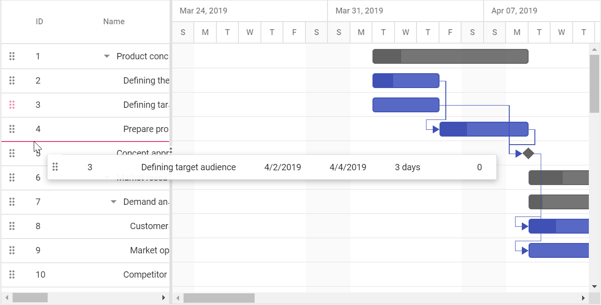
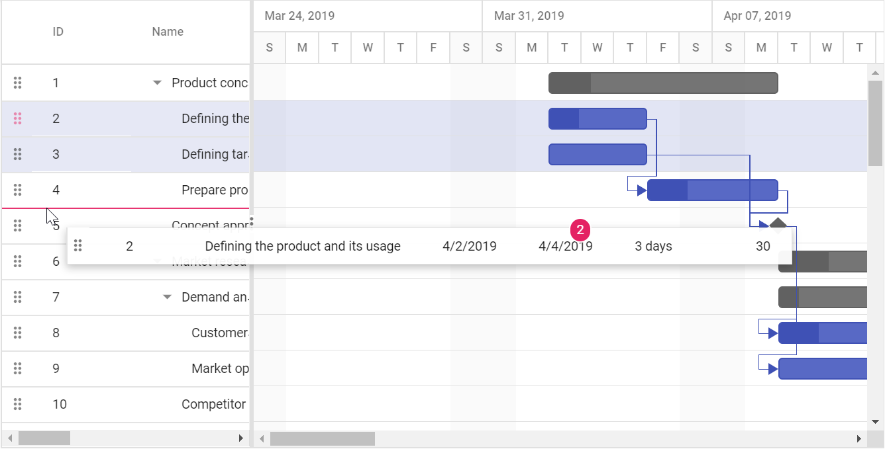

# Enabling Drag and Drop for Rows in ASP.NET MVC Gantt Chart

You can dynamically rearrange the rows in the Gantt control using the `AllowRowDragAndDrop` property. This property enables or disables row drag and drop in Gantt. Using this feature, rows can be dropped above and below as a sibling or child to the existing rows.










## Multiple row drag and drop

Gantt also supports dragging multiple rows at a time and dropping them on any rows above, below, or at child positions. In Gantt, enable the multiple drag and drop by setting the `SelectionSettings.Type` to `Multiple` and the `AllowRowDragAndDrop` property to `true`.










## Taskbar drag and drop between rows

The Gantt feature empowers users to efficiently reorganize records by seamlessly moving taskbar and rearranging their positions through a simple drag-and-drop action. Using this feature, rows can be dropped at above and below as a sibling or child to the existing rows.

This mode can be enable by setting the [AllowTaskbarDragAndDrop](https://help.syncfusion.com/cr/aspnetmvc-js2/Syncfusion.EJ2.Gantt.Gantt.html#Syncfusion_EJ2_Gantt_Gantt_AllowTaskbarDragAndDrop) property to `true`.










## Drag and drop events

We provide various events to customize the row drag and drop action, the following table explains about the available events and its details.

| Event Name           | Description                                             |
| -------------------- | ------------------------------------------------------- |
| `RowDragStartHelper` | Triggers when clicking the drag icon or Gantt row.      |
| `RowDragStart`       | Triggers when drag action starts in Gantt.              |
| `RowDrag`            | Triggers while dragging the Gantt row.                  |
| `RowDrop`            | Triggers when a drag row was dropped on the target row. |

## Customize row drag and drop action

In Gantt, the `RowDragStartHelper` and `RowDrop` events are triggered on row drag and drop action. Using this event, you can prevent dragging of particular record, validate the drop position, and cancel the drop action based on the target record and dragged record. The following topics explains about this.

## Prevent dragging of particular record

You can prevent drag action of the particular record by setting the `cancel` property to `true`, which is available in the `RowDragStartHelper` event argument based on our requirement. In the following sample, drag action was restricted for first parent record and its child records.










## Validating drop position

You can prevent drop action based on the drop position and target record, by this, you can prevent dropping particular task on a specific task or specific position. This can be achieved by setting the `cancel` property to `true`, which is available in the `RowDrop` event argument.

In the following sample, we have prevented the drop action based on the position. In this sample, you cannot drop row as child in any of the available rows.










## Prevent reordering a row as child to another row

You can prevent the default behavior of dropping rows as children to the target by setting the `cancel` property to `true` in [rowDrop](https://help.syncfusion.com/cr/aspnetmvc-js2/Syncfusion.EJ2.TreeGrid.TreeGrid.html#Syncfusion_EJ2_TreeGrid_TreeGrid_RowDrop) event argument. You can also change the drop position after cancelling using `reorderRows` method.

In the below example drop action is cancelled and dropped above to target row.










## Perform row drag and drop action programmatically

Gantt provides option to perform row drag and drop action programmatically by using the `reorderRows` method, this method can be used for any external actions like button click. The following arguments are used to specify the positions to drag and drop a row:

- `fromIndexes`: Index value of source(dragging) row.
- `toIndex`: Value of target index.
- `position`: Drop positions such as above, below, or child.

The following code example shows how to drag and drop a row on button click action.









