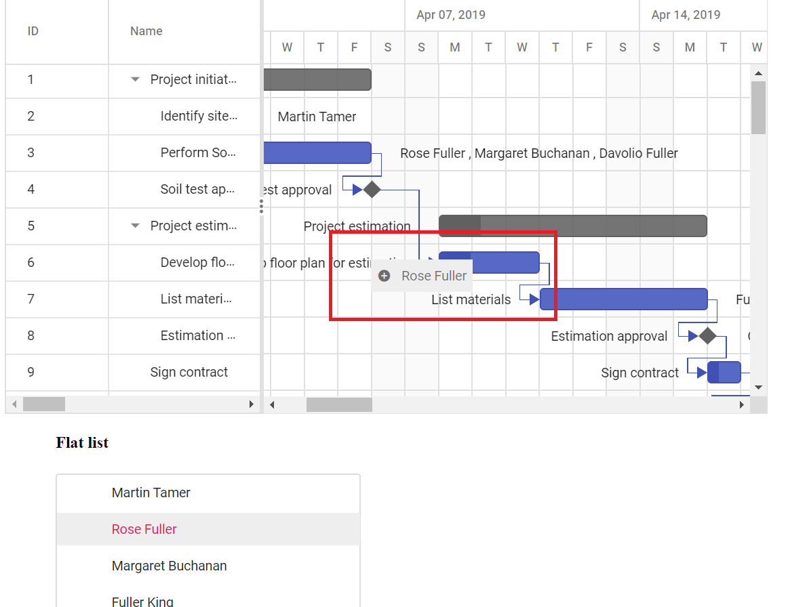

# Drag and Drop from Another Component in ASP.NET MVC Gantt Chart

In Gantt, it is possible to drag a record from another component and drop it in Gantt chart with updating the Gantt record. Here, dragging an item from `TreeView` component to Gantt and that item is updated as a resource for the Gantt record, we can achieve this, by using [`nodeDragStop`](https://help.syncfusion.com/cr/aspnetmvc-js2/Syncfusion.EJ2.Navigations.TreeView.html#Syncfusion_EJ2_Navigations_TreeView_NodeDragStop) event of `TreeView` control.










The following screenshot shows dropping record from another component in to Gantt, and **Rose Fuller** is added as resource for the task **Develop floor plan estimation**.

