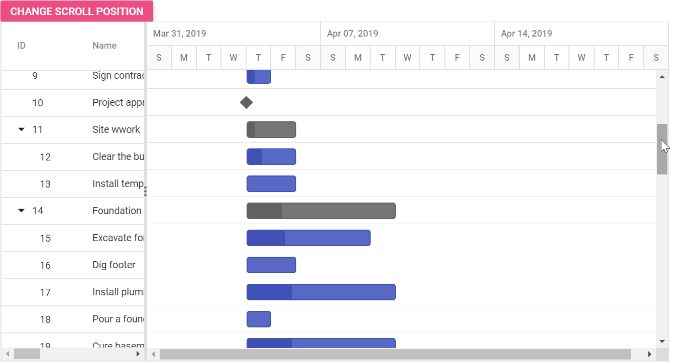

# Controlling Vertical Scroll Position in ASP.NET MVC Gantt Chart

In the Gantt control, you can set the vertical scroller position dynamically by clicking the custom button using the `setScrollTop` method.










