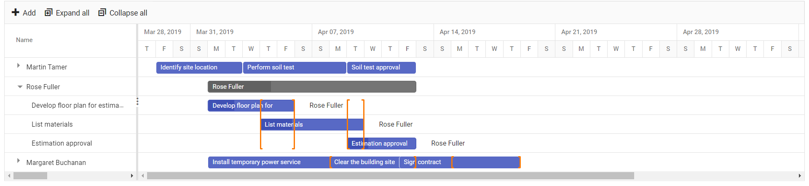

# Multi Taskbar in ASP.NET MVC Gantt Chart

## Resource Multi Taskbar

To visualize multiple tasks assigned to each resource in a row when the records are in the collapsed state. Enable it by setting the `enableMultiTaskbar` property value to `true`.

The collapse or expand action of a resource record can be achieved only using the tree grid side arrow icon, because it will be disabled on the chart side for this support.

When a resource has multiple tasks scheduled on the same date, then the tasks will be overlapped one another. Taskbar editing is also possible to change the task scheduling on the collapsed state.

N> By default, the `enableMultiTaskbar` property value is `false`.










## Disable taskbar overlap

In Gantt, you can disable taskbar overlap between resource tasks using the [`AllowTaskbarOverlap`](https://help.syncfusion.com/cr/aspnetmvc-js2/Syncfusion.EJ2.Gantt.Gantt.html#Syncfusion_EJ2_Gantt_Gantt_AllowTaskbarOverlap) property. This prevents the taskbars for different tasks from overlapping on the same row, making it easier to distinguish between the different tasks and manage resources effectively.

When `AllowTaskbarOverlap` is set to false, the resources are displayed in a single row and the row height will be extended to occupy the tasks of the resource when it is in a collapsed state. This view allows you to easily identify any overallocation of tasks for a resource in a project.

It's important to note that when `AllowTaskbarOverlap` is disabled, task dependencies or relationships cannot be established between tasks that are rendered in multiple lines for the same resource. If you need to establish dependencies between tasks for the same resource, you may want to consider enabling taskbar overlap.









