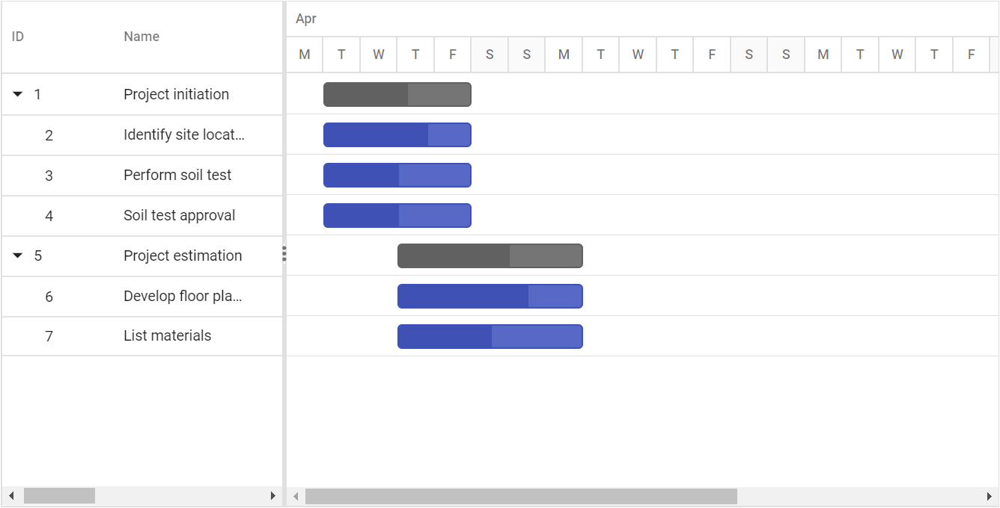
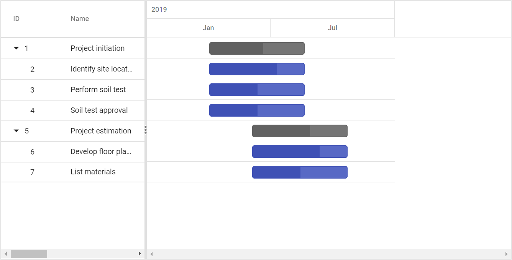
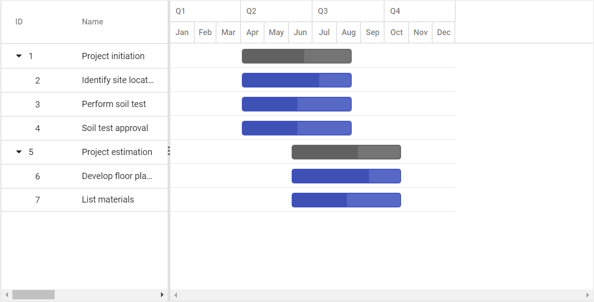
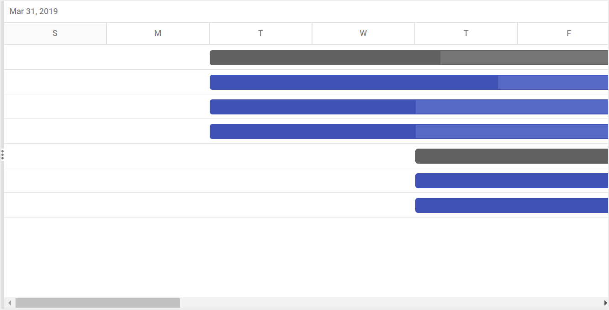
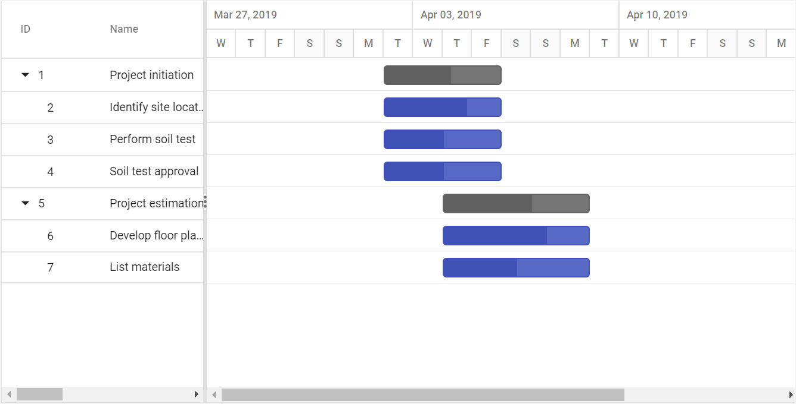

# Customizing Timeline Top and Bottom Tiers in ASP.NET MVC Gantt Chart

Gantt control contains a two tier layout in the timeline. Customize the top tier and bottom tier using the [`TopTier`](https://help.syncfusion.com/cr/aspnetmvc-js2/Syncfusion.EJ2.Gantt.GanttTimelineSettings.html#Syncfusion_EJ2_Gantt_GanttTimelineSettings_TopTier) and [`BottomTier`](https://help.syncfusion.com/cr/aspnetmvc-js2/Syncfusion.EJ2.Gantt.GanttTimelineSettings.html#Syncfusion_EJ2_Gantt_GanttTimelineSettings_BottomTier) properties. The timeline tier's unit can be defined using the [`Unit`](https://help.syncfusion.com/cr/aspnetmvc-js2/Syncfusion.EJ2.Gantt.GanttTimelineTierSettings.html#Syncfusion_EJ2_Gantt_GanttTimelineTierSettings_Unit) property, the [`Format`](https://help.syncfusion.com/cr/aspnetmvc-js2/Syncfusion.EJ2.Gantt.GanttTimelineTierSettings.html#Syncfusion_EJ2_Gantt_GanttTimelineTierSettings_Format) property defines the date format of the timeline cell, the [`Count`](https://help.syncfusion.com/cr/aspnetmvc-js2/Syncfusion.EJ2.Gantt.GanttTimelineTierSettings.html#Syncfusion_EJ2_Gantt_GanttTimelineTierSettings_Count) property defines how many units will be combined as a single cell, and the [`Formatter`](https://help.syncfusion.com/cr/aspnetmvc-js2/Syncfusion.EJ2.Gantt.GanttTimelineTierSettings.html#Syncfusion_EJ2_Gantt_GanttTimelineTierSettings_Formatter) property defines a custom method to format the date value of the timeline cell.










## Combining timeline cells

In Gantt, timeline cells in top tier and bottom tier can be combined with number of timeline units, this can be achieved by using [`TopTier.Count`](https://help.syncfusion.com/cr/aspnetmvc-js2/Syncfusion.EJ2.Gantt.GanttTimelineTierSettings.html#Syncfusion_EJ2_Gantt_GanttTimelineTierSettings_Count) and [`BottomTier.Count`](https://help.syncfusion.com/cr/aspnetmvc-js2/Syncfusion.EJ2.Gantt.GanttTimelineTierSettings.html#Syncfusion_EJ2_Gantt_GanttTimelineTierSettings_Count) properties. Refer the below sample.










## Format value of timeline cell

In the Gantt control, you can format the value of top and bottom timeline cells using the standard date format string or the custom formatter method. This can be done using the [`TopTier.Format`](https://help.syncfusion.com/cr/aspnetmvc-js2/Syncfusion.EJ2.Gantt.GanttTimelineTierSettings.html#Syncfusion_EJ2_Gantt_GanttTimelineTierSettings_Format), [`TopTier.Formatter`](https://help.syncfusion.com/cr/aspnetmvc-js2/Syncfusion.EJ2.Gantt.GanttTimelineTierSettings.html#Syncfusion_EJ2_Gantt_GanttTimelineTierSettings_Formatter), [`BottomTier.Format`](https://help.syncfusion.com/cr/aspnetmvc-js2/Syncfusion.EJ2.Gantt.GanttTimelineTierSettings.html#Syncfusion_EJ2_Gantt_GanttTimelineTierSettings_Format) and [`BottomTier.Formatter`](https://help.syncfusion.com/cr/aspnetmvc-js2/Syncfusion.EJ2.Gantt.GanttTimelineTierSettings.html#Syncfusion_EJ2_Gantt_GanttTimelineTierSettings_Formatter) properties. The following example shows how to use the formatter method for timeline cells.










## Timeline cell width

In the Gantt control, you can define the width value of timeline cell using the [`TimelineSettings.TimelineUnitSize`](https://help.syncfusion.com/cr/aspnetmvc-js2/Syncfusion.EJ2.Gantt.GanttTimelineSettings.html#Syncfusion_EJ2_Gantt_GanttTimelineSettings_TimelineUnitSize) property. This value will be set to the bottom timeline cell, and the width value of top timeline cell will be calculated automatically based on bottom tier cell width using the [`TopTier.Unit`](https://help.syncfusion.com/cr/aspnetmvc-js2/Syncfusion.EJ2.Gantt.GanttTimelineTierSettings.html#Syncfusion_EJ2_Gantt_GanttTimelineTierSettings_Unit) and [`TimelineSettings.TimelineUnitSize`](https://help.syncfusion.com/cr/aspnetmvc-js2/Syncfusion.EJ2.Gantt.GanttTimelineSettings.html#Syncfusion_EJ2_Gantt_GanttTimelineSettings_TimelineUnitSize) properties. Refer to the following example.










## Week start day customization

In the Gantt control, you can customize the week start day using the [`WeekStartDay`](https://help.syncfusion.com/cr/aspnetmvc-js2/Syncfusion.EJ2.Gantt.GanttTimelineSettings.html#Syncfusion_EJ2_Gantt_GanttTimelineSettings_WeekStartDay) property. By default, the [`WeekStartDay`](https://help.syncfusion.com/cr/aspnetmvc-js2/Syncfusion.EJ2.Gantt.GanttTimelineSettings.html#Syncfusion_EJ2_Gantt_GanttTimelineSettings_WeekStartDay) is set to 0, which specifies the Sunday as a start day of the week. But, you can customize the week start day by using the following code example.










## Customize automatic timescale update action

In the Gantt control, the schedule timeline will be automatically updated when the tasks date values are updated beyond the project start date and end date ranges. This can be enabled or disabled using the [`UpdateTimescaleView`](https://help.syncfusion.com/cr/aspnetmvc-js2/Syncfusion.EJ2.Gantt.GanttTimelineSettings.html#Syncfusion_EJ2_Gantt_GanttTimelineSettings_UpdateTimescaleView) property.









