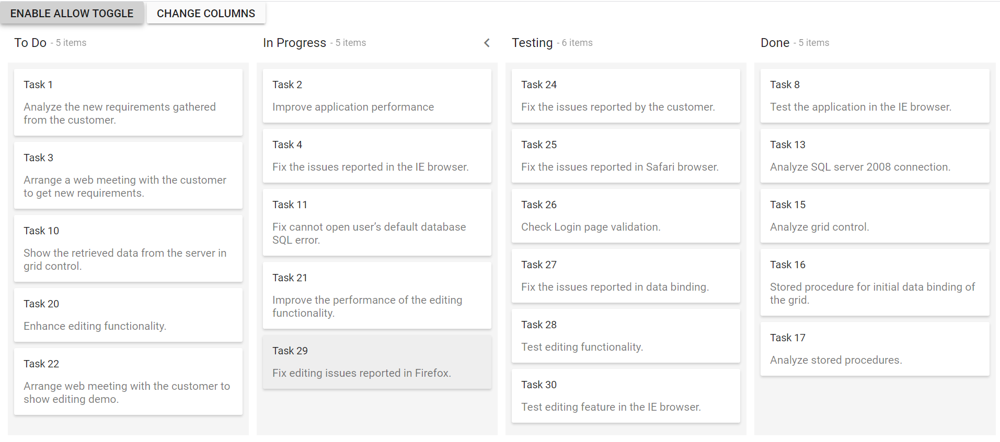

# Modify Columns Programmatically in ASP.NET MVC Kanban

You can dynamically change the Kanban columns by using the [`columns`](https://help.syncfusion.com/cr/aspnetmvc-js2/Syncfusion.EJ2.Kanban.Kanban.html#Syncfusion_EJ2_Kanban_Kanban_Columns) property.

In the below sample, you can dynamically change the [`allowToggle`](https://help.syncfusion.com/cr/aspnetmvc-js2/Syncfusion.EJ2.Kanban.KanbanColumn.html#Syncfusion_EJ2_Kanban_KanbanColumn_AllowToggle) property at the particular column when you click on the button. You can also change the initially created columns to the new Kanban columns by using the [`columns`](https://help.syncfusion.com/cr/aspnetmvc-js2/Syncfusion.EJ2.Kanban.Kanban.html#Syncfusion_EJ2_Kanban_Kanban_Columns) property when you click on the button.










Output be like the below.

