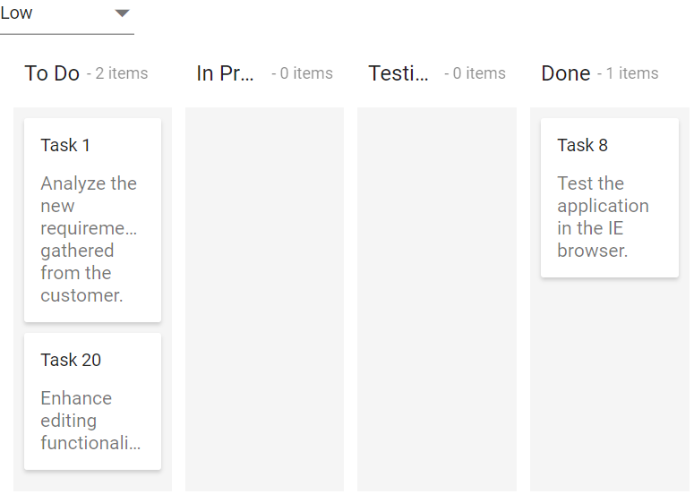

# Filter Cards in ASP.NET MVC Kanban

You can filter the collection of cards from the dataSource and display it on the Kanban board by using the [`query`](../../api/kanban#query) property.

In the below sample, you can filter the cards based on the ‘where’ query and display the filtered data to the Kanban board.










Output be like the below.

