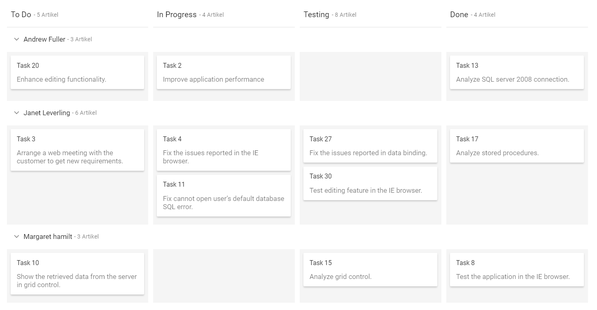
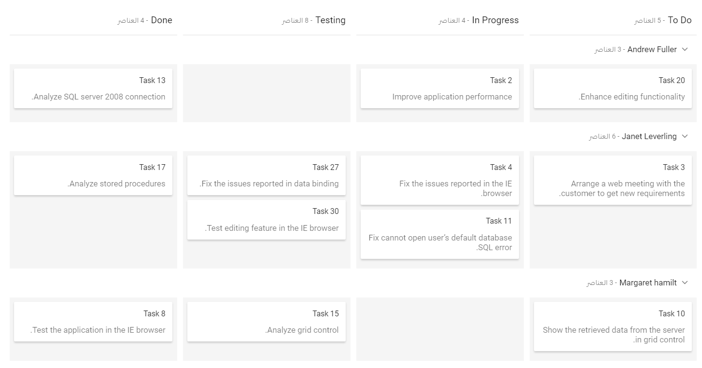

# Globalization and Localization Support in ASP.NET MVC Kanban

The localization library allows you to localize the default text content of the Kanban to different cultures using the `Locale` property.

In Kanban, total count and min or max count text alone will be localized based on culture.

| Locale key | en-US (default)  |
|------|------|
| items |  items |
| min |  Min |
| max |  Max |
| cardsSelected | Cards Selected |
| addTitle | Add New Card |
| editTitle | Edit Card Details |
| deleteTitle | Delete Card |
| deleteContent | Are you sure you want to delete this card? |
| save | Save |
| delete | Delete |
| cancel | Cancel |
| yes | Yes |
| no | No |
| close | Close |
| noCard | No cards to display |
| unassigned | Unassigned |

## Loading translations

To load translation object in an application, use `load` function of `L10n` class.

The following example demonstrates the Kanban in `Deutsch` culture.






























Output be like the below.

## Right to left (RTL)

The Kanban provides an option to switch its text direction and layout from right to left. It improves the user experiences and accessibility for users who use right-to-left languages (Arabic, Farsi, Urdu, etc.). To enable right-to-left mode in Kanban, set the `EnableRtl` to true.






























Output be like the below.

