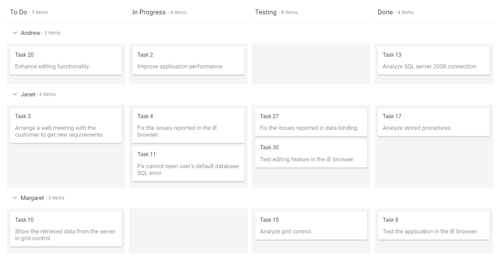
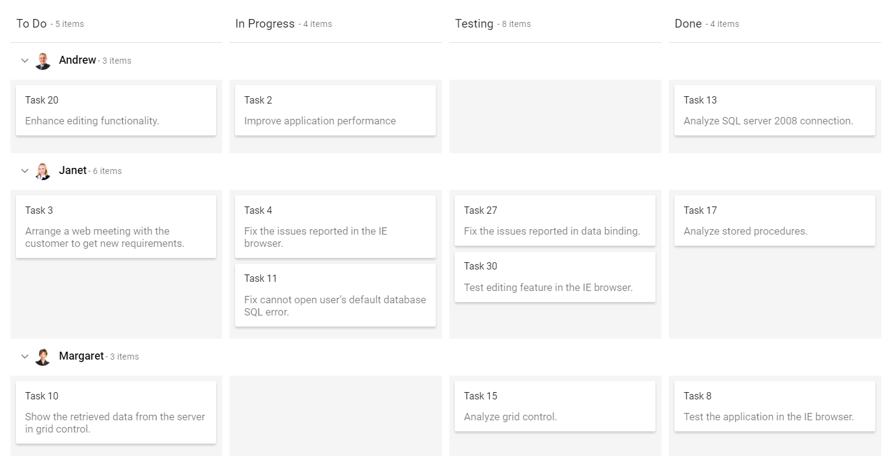
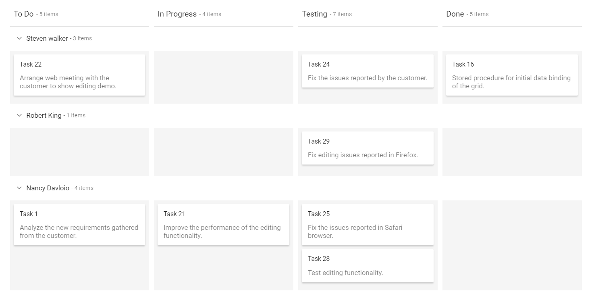
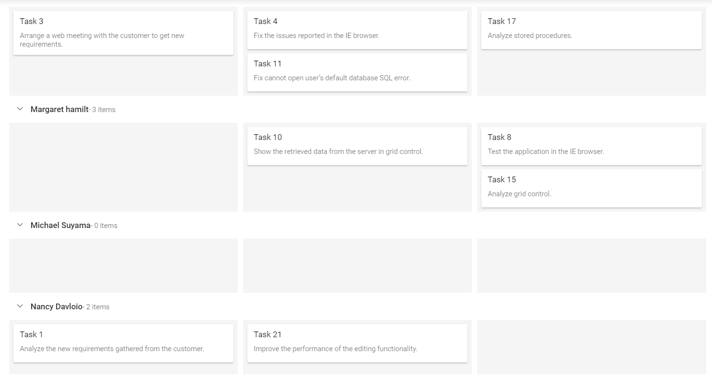
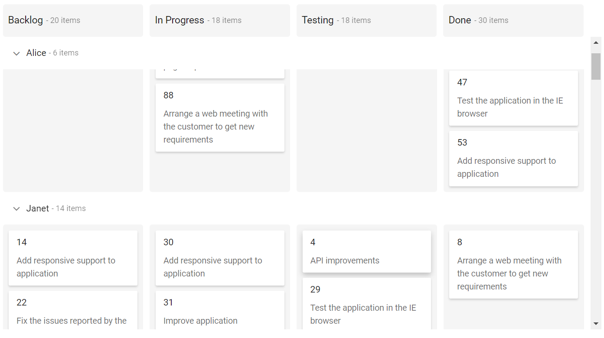

# Swimlane Grouping in ASP.NET MVC Kanban

Swimlanes are horizontal categorizations of cards on the Kanban board.  It is used for grouping of cards, which brings transparency to the workflow process.

## Render swimlane row

Cards can be grouped based on [`KeyField`](https://help.syncfusion.com/cr/aspnetmvc-js2/Syncfusion.EJ2.Kanban.Kanban.html#Syncfusion_EJ2_Kanban_Kanban_KeyField) and displayed in rows, which are separated by columns. It is mandatory to define the [`KeyField`](https://help.syncfusion.com/cr/aspnetmvc-js2/Syncfusion.EJ2.Kanban.Kanban.html#Syncfusion_EJ2_Kanban_Kanban_KeyField) that is mapped from the datasource for rendering swimlane rows in the Kanban board.













Output be like the below.

## Custom row text

Customize the swimlane row header text by using the [`TextField`](https://help.syncfusion.com/cr/aspnetmvc-js2/Syncfusion.EJ2.Kanban.KanbanSwimlaneSettings.html#Syncfusion_EJ2_Kanban_KanbanSwimlaneSettings_TextField) property mapped from datasource.

N> It is not mandatory to define the [`TextField`](https://help.syncfusion.com/cr/aspnetmvc-js2/Syncfusion.EJ2.Kanban.KanbanSwimlaneSettings.html#Syncfusion_EJ2_Kanban_KanbanSwimlaneSettings_TextField) to [`SwimlaneSettings`](https://help.syncfusion.com/cr/aspnetmvc-js2/Syncfusion.EJ2.Kanban.Kanban.html#Syncfusion_EJ2_Kanban_Kanban_SwimlaneSettings). It will automatically consider the [`KeyField`](https://help.syncfusion.com/cr/aspnetmvc-js2/Syncfusion.EJ2.Kanban.Kanban.html#Syncfusion_EJ2_Kanban_Kanban_KeyField) to swimlane row header text.
  If the mapping [`TextField`](https://help.syncfusion.com/cr/aspnetmvc-js2/Syncfusion.EJ2.Kanban.KanbanSwimlaneSettings.html#Syncfusion_EJ2_Kanban_KanbanSwimlaneSettings_TextField) key is not present in the datasource, it will consider the swimlane [`KeyField`](https://help.syncfusion.com/cr/aspnetmvc-js2/Syncfusion.EJ2.Kanban.Kanban.html#Syncfusion_EJ2_Kanban_Kanban_KeyField) as swimlane row header text.













## Template

You can customize the Kanban swimlane row by using the `Template` property, which is specified within the [`SwimlaneSettings`](https://help.syncfusion.com/cr/aspnetmvc-js2/Syncfusion.EJ2.Kanban.Kanban.html#Syncfusion_EJ2_Kanban_Kanban_SwimlaneSettings) property. In this demo, the swimlane header is customized with HTML element.













Output be like the below.

## Sorting

Swimlane rows are rendered on descending order when using the [`SortBy`](https://help.syncfusion.com/cr/aspnetmvc-js2/Syncfusion.EJ2.Kanban.KanbanSortSettings.html#Syncfusion_EJ2_Kanban_KanbanSortSettings_SortBy) property set to `Descending` order. By default, swimlane rows are rendered by **Ascending** order.













Output be like the below.

## Drag-and-drop

By default, The Kanban does not allow dragging the cards across the swimlane rows. Enabling the `DragAndDrop` property allows you to drag the cards across the swimlane rows, which is specified inside [`SwimlaneSettings`](https://help.syncfusion.com/cr/aspnetmvc-js2/Syncfusion.EJ2.Kanban.Kanban.html#Syncfusion_EJ2_Kanban_Kanban_SwimlaneSettings) property.













## Create empty row

You can render the empty swimlane row by enabling the `ShowEmptyRow` property. If mapping [`KeyField`](https://help.syncfusion.com/cr/aspnetmvc-js2/Syncfusion.EJ2.Kanban.Kanban.html#Syncfusion_EJ2_Kanban_Kanban_KeyField) does not have cards, empty swimlane row will be rendered.













Output be like the below.

## Calculate cards count

Users can show or hide the cards count by swimlane row in header when enabling the [`ShowItemCount`](https://help.syncfusion.com/cr/aspnetmvc-js2/Syncfusion.EJ2.Kanban.KanbanColumn.html#Syncfusion_EJ2_Kanban_KanbanColumn_ShowItemCount) property, which is enabled by default on the Kanban board.

N> Provided localization support for **Items** text.

In below demo, disabled on [`ShowItemCount`](https://help.syncfusion.com/cr/aspnetmvc-js2/Syncfusion.EJ2.Kanban.KanbanColumn.html#Syncfusion_EJ2_Kanban_KanbanColumn_ShowItemCount) property on rendering swimlane row without total count.













Output be like the below.

## Enable frozen rows

Frozen rows provide an option to make the current swimlane row header text always visible on top of the content while scrolling the Kanban content. The swimlane header text will be changed dynamically, when you scroll to another swimlane row.

By default, the [`EnableFrozenRows`](https://help.syncfusion.com/cr/aspnetmvc-js2/Syncfusion.EJ2.Kanban.KanbanSwimlaneSettings.html#Syncfusion_EJ2_Kanban_KanbanSwimlaneSettings_EnableFrozenRows) property is set as `false`. If you wish to show the swimlane frozen rows, you can enable the [`EnableFrozenRows`](https://help.syncfusion.com/cr/aspnetmvc-js2/Syncfusion.EJ2.Kanban.KanbanSwimlaneSettings.html#Syncfusion_EJ2_Kanban_KanbanSwimlaneSettings_EnableFrozenRows) property.

N> This feature support only when using Kanban content scrolling.













Output be like the below.

