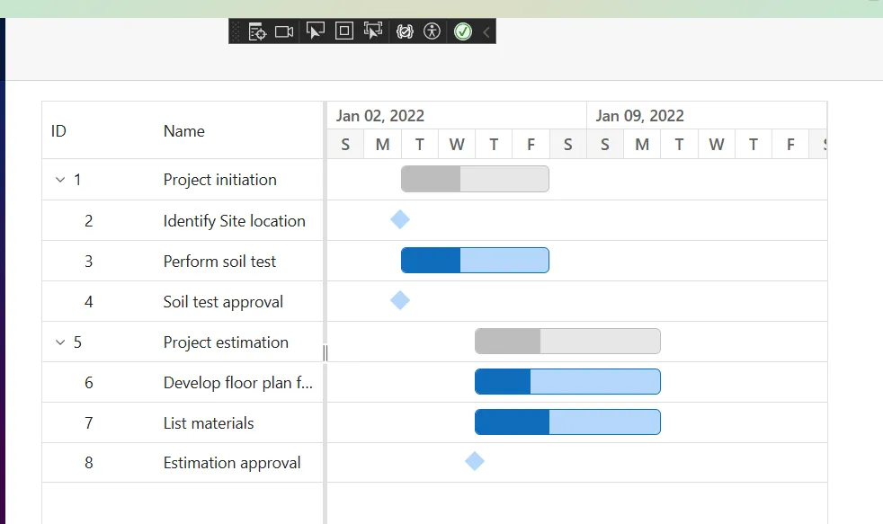
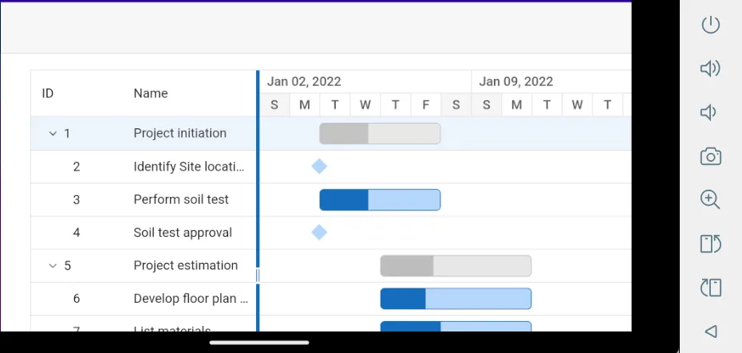

---
layout: post
title: Getting Started with Blazor Gantt Chart in MAUI App | Syncfusion
description: Learn how to install and set up the Syncfusion Blazor Gantt Chart in a Blazor MAUI App with task data binding and timeline rendering.
keywords: blazor gantt chart, getting started, maui, blazor maui, syncfusion gantt, task binding, timeline rendering
canonical: https://help.syncfusion.com/gantt-sdk/blazor/gantt-chart/getting-started-with-maui-app
platform: gantt-sdk
control: Getting Started - Gantt Chart
documentation: ug
domainurl: https://help.syncfusion.com/gantt-sdk
---

# Getting Started with Blazor Gantt Chart in MAUI App

This section briefly explains how to include the [Blazor Gantt Chart](https://www.syncfusion.com/gantt-sdk/blazor-gantt-chart) component in your Blazor MAUI application using both [Visual Studio](https://visualstudio.microsoft.com/vs/) and [Visual Studio Code](https://code.visualstudio.com/).

> **Ready to streamline your Blazor development?**  Discover the full potential of Blazor components with AI Coding Assistants. Effortlessly integrate, configure, and enhance your projects with intelligent, context-aware code suggestions, streamlined setups, and real-time insights—all seamlessly integrated into your preferred AI-powered IDEs like VS Code, Cursor, Code Studio and more. [Explore AI Coding Assistants](https://blazor.syncfusion.com/documentation/ai-coding-assistant/overview).

## Create a new Blazor MAUI App





Create a Blazor MAUI App using Visual Studio via [Microsoft Templates](https://learn.microsoft.com/en-us/dotnet/maui/get-started/first-app?pivots=devices-windows&view=net-maui-9.0&tabs=vswin). For detailed instructions, refer to the [Blazor MAUI App Getting Started](https://blazor.syncfusion.com/documentation/getting-started/maui-blazor-app) documentation.





Run the following command to create a new Blazor MAUI App.




dotnet new maui-blazor -o MauiBlazorApp
cd MauiBlazorApp




Alternatively, create a **Blazor MAUI App** using Visual Studio Code via [Microsoft Templates](https://learn.microsoft.com/en-us/dotnet/maui/get-started/first-app?pivots=devices-windows&view=net-maui-9.0&tabs=visual-studio-code) or the [Syncfusion® Blazor Extension](https://blazor.syncfusion.com/documentation/visual-studio-code-integration/create-project). For detailed instructions, refer to the [Blazor MAUI App Getting Started](https://blazor.syncfusion.com/documentation/getting-started/maui-blazor-app) documentation.





Run the following command to create a new Blazor MAUI App.




dotnet new maui-blazor -o MauiBlazorApp
cd MauiBlazorApp








## Install the required Blazor packages

Install the [Syncfusion.Blazor.Gantt](https://www.nuget.org/packages/Syncfusion.Blazor.Gantt) and [Syncfusion.Blazor.Themes](https://www.nuget.org/packages/Syncfusion.Blazor.Themes/) NuGet packages. All Syncfusion Blazor packages are available on [nuget.org](https://www.nuget.org/packages?q=syncfusion.blazor). See the [NuGet packages](https://blazor.syncfusion.com/documentation/nuget-packages) topic for details.





1. Go to *Tools → NuGet Package Manager → Manage NuGet Packages for Solution*.
2. Search the required NuGet packages (`Syncfusion.Blazor.Gantt` and `Syncfusion.Blazor.Themes`) and install them.

Alternatively, you can install the same packages using the Package Manager Console with the following command.




Install-Package Syncfusion.Blazor.Gantt -Version {{ site.releaseversion }}
Install-Package Syncfusion.Blazor.Themes -Version {{ site.releaseversion }}








Open the terminal and run the following command.




dotnet add package Syncfusion.Blazor.Gantt -v {{ site.releaseversion }}
dotnet add package Syncfusion.Blazor.Themes -v {{ site.releaseversion }}








Open the command prompt and run the following command.




dotnet add package Syncfusion.Blazor.Gantt -v {{ site.releaseversion }}
dotnet add package Syncfusion.Blazor.Themes -v {{ site.releaseversion }}








## Add import namespaces

After the packages are installed, open the **~/Components/_Imports.razor** file and import the `Syncfusion.Blazor` and `Syncfusion.Blazor.Gantt` namespaces.




@using Syncfusion.Blazor 
@using Syncfusion.Blazor.Gantt




## Register the Blazor service

Open the **MauiProgram.cs** file in Blazor MAUI App and register the Blazor service.




....
using Syncfusion.Blazor;
....

public static class MauiProgram
{
    public static MauiApp CreateMauiApp()
    {
        ....
        builder.Services.AddSyncfusionBlazor();
        ....
    }
}




## Add stylesheet and script resources

The theme stylesheet and script can be accessed from NuGet through [Static Web Assets](https://blazor.syncfusion.com/documentation/appearance/themes#static-web-assets). Include the [stylesheet](https://blazor.syncfusion.com/documentation/appearance/themes) and the [script references](https://blazor.syncfusion.com/documentation/common/adding-script-references) in the **~wwwroot/index.html** file.




....
<link href="_content/Syncfusion.Blazor.Themes/fluent2.css" rel="stylesheet" />
....




## Add Blazor Gantt Chart component

Open a Razor file located in the **~/Components/Pages/*.razor** (for example, **Home.razor**) and add the [Blazor Gantt Chart](https://www.syncfusion.com/gantt-sdk/blazor-gantt-chart) component inside the razor file.




@using Syncfusion.Blazor.Gantt

<SfGantt DataSource="@TaskCollection" Height="450px" Width="700px">
    <GanttTaskFields Id="TaskId" Name="TaskName" StartDate="StartDate" EndDate="EndDate" Duration="Duration" Progress="Progress" ParentID="ParentId">
    </GanttTaskFields>
</SfGantt>

@code 
{
    public List<TaskData>? TaskCollection { get; set; }
    protected override void OnInitialized()
    {
        TaskCollection = GetTaskCollection();
    }

    public class TaskData
    {
        public int TaskId { get; set; }
        public string? TaskName { get; set; }
        public DateTime StartDate { get; set; }
        public DateTime EndDate { get; set; }
        public string? Duration { get; set; }
        public int Progress { get; set; }
        public int? ParentId { get; set; }
    }

    public static List<TaskData> GetTaskCollection()
    {
        List<TaskData> Tasks = new List<TaskData>()
        {
            new TaskData() { TaskId = 1, TaskName = "Project initiation", StartDate = new DateTime(2026, 01, 05), EndDate = new DateTime(2026, 01, 08), },
            new TaskData() { TaskId = 2, TaskName = "Identify Site location", StartDate = new DateTime(2026, 01, 05), Duration = "0", Progress = 30, ParentId = 1, },
            new TaskData() { TaskId = 3, TaskName = "Perform soil test", StartDate = new DateTime(2026, 01, 05), EndDate = new DateTime(2026, 01, 08), Progress = 40, ParentId = 1, },
            new TaskData() { TaskId = 4, TaskName = "Soil test approval", StartDate = new DateTime(2026, 01, 05), Duration = "0", Progress = 30, ParentId = 1, },
            new TaskData() { TaskId = 5, TaskName = "Project estimation", StartDate = new DateTime(2026, 01, 05), EndDate = new DateTime(2026, 01, 10), },
            new TaskData() { TaskId = 6, TaskName = "Develop floor plan for estimation", StartDate = new DateTime(2026, 01, 07), EndDate = new DateTime(2026, 01, 09), Progress = 30, ParentId = 5, },
            new TaskData() { TaskId = 7, TaskName = "List materials", StartDate = new DateTime(2026, 01, 07), EndDate = new DateTime(2026, 01, 09), Progress = 40, ParentId = 5, },
            new TaskData() { TaskId = 8, TaskName = "Estimation approval", StartDate = new DateTime(2026, 01, 07), Duration = "0", Progress = 30, ParentId = 5, }
        };
        return Tasks;
    }
}






## Run the application on Windows





Press <kbd>Ctrl</kbd>+<kbd>F5</kbd> (Windows) or <kbd>⌘</kbd>+<kbd>F5</kbd> (macOS) to launch the application. The [Blazor Gantt Chart](https://www.syncfusion.com/gantt-sdk/blazor-gantt-chart) component will render in your default web browser.





Open the terminal and run the following command.




dotnet run








Open the command prompt and run the following command.




dotnet run








## Run the application on Android

Run the sample in Android Emulator mode, and it will launch the Blazor MAUI application on the configured Android virtual device.

To run the Blazor Gantt Chart in a Blazor Android MAUI application using the Android emulator, follow these steps:

Refer [here](https://learn.microsoft.com/en-us/dotnet/maui/android/emulator/device-manager#android-device-manager-on-windows) to install and launch Android emulator.

N> If you encounter any errors while using the Android Emulator, refer to the following link for troubleshooting guidance [Troubleshooting Android Emulator](https://learn.microsoft.com/en-us/dotnet/maui/android/emulator/troubleshooting).

## See also

1. [Getting Started with Blazor Web App in Visual Studio](https://blazor.syncfusion.com/documentation/getting-started/blazor-web-app)
2. [Getting Started with Blazor WebAssembly App](https://blazor.syncfusion.com/documentation/getting-started/blazor-webassembly-app)
3. [Getting Started with Blazor Server App](https://blazor.syncfusion.com/documentation/getting-started/blazor-server-side-visual-studio)