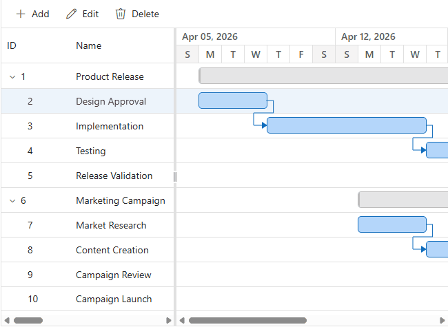

# Task Constraints in Blazor Gantt Chart

Task constraints define rules that restrict when an automatically scheduled task can start or finish. They support fixed-date activities, deadline-driven planning, milestone enforcement, and controlled task movement while preserving task dependencies and working-calendar rules.

Task constraints are useful for activities such as contract-controlled work, regulatory submissions, product launches, audits, and procurement milestones. Constraint values can be loaded from a data source, edited through the task dialog, or updated programmatically.

>* Task constraints are evaluated only for auto-scheduled tasks. Constraint values on manually scheduled tasks are informational until the task is changed to auto scheduling.

## Task Constraints Configuration

### Constraint precedence

Constraints defined on child tasks take precedence over parent task dates. Parent tasks support only AsSoonAsPossible, AsLateAsPossible, and StartNoEarlierThan. Unsupported parent constraint values are converted to AsSoonAsPossible during data binding.

### Task model configuration

The following model includes the fields required to demonstrate task constraints:

```csharp
public class TaskData
{
    public int TaskId { get; set; }
    public string? TaskName { get; set; }
    public DateTime StartDate { get; set; }
    public DateTime? EndDate { get; set; }
    public string? Duration { get; set; }
    public int Progress { get; set; }
    public string? Predecessor { get; set; }
    public int? ParentId { get; set; }
    public TaskConstraintType ConstraintType { get; set; }
    public DateTime? ConstraintDate { get; set; }
}
```

### Constraint type mapping

Map the task model property that contains the constraint type through the [ConstraintType](https://help.syncfusion.com/cr/blazor/Syncfusion.Blazor.Gantt.GanttTaskFields.html) property of [GanttTaskFields](https://help.syncfusion.com/cr/blazor/Syncfusion.Blazor.Gantt.GanttTaskFields.html). Values must correspond to the [TaskConstraintType](https://help.syncfusion.com/cr/blazor/Syncfusion.Blazor.Gantt.TaskConstraintType.html) enumeration and identify the specific scheduling rule for the task, such as `AsSoonAsPossible`, `AsLateAsPossible`, `MustStartOn`, `MustFinishOn`, `StartNoEarlierThan`, `StartNoLaterThan`, `FinishNoEarlierThan`, or `FinishNoLaterThan`.

### Constraint date mapping

Map the task model property that contains the constraint date through the [ConstraintDate](https://help.syncfusion.com/cr/blazor/Syncfusion.Blazor.Gantt.GanttTaskFields.html) property of [GanttTaskFields](https://help.syncfusion.com/cr/blazor/Syncfusion.Blazor.Gantt.GanttTaskFields.html). This mapping must point to a nullable `DateTime` field in the task model that stores the reference date used by a date-based constraint. `AsSoonAsPossible` and `AsLateAsPossible` do not require a `ConstraintDate` field. Keep the field available for date-aware constraints and leave it empty for no-date constraints.

The task model should keep `ConstraintType` so the scheduling engine can validate the selected constraint rule and the related date consistently during dependency propagation, dialog editing, taskbar updates, and programmatic changes.

### GanttTaskFields configuration

The following example maps task identity, scheduling, dependency, and constraint fields:




@using Syncfusion.Blazor.Gantt

<SfGantt TValue="TaskData" DataSource="@TaskCollection" Height="450px" Width="100%"
         ProjectStartDate="@ProjectStartDate" ProjectEndDate="@ProjectEndDate"
         Toolbar="@(new List<string>() { "Add", "Edit", "Update", "Delete", "Cancel" })">
    <GanttTaskFields Id="TaskId" Name="TaskName" StartDate="StartDate" EndDate="EndDate"
                     Duration="Duration" Progress="Progress" Dependency="Predecessor"
                     ParentID="ParentId" ConstraintType="ConstraintType" ConstraintDate="ConstraintDate">
    </GanttTaskFields>
    <GanttEditSettings AllowAdding="true" AllowEditing="true" AllowDeleting="true" AllowTaskbarEditing="true">
    </GanttEditSettings>
</SfGantt>

@code {
     public List<TaskData> TaskCollection { get; set; } = new()
    {
        new TaskData { TaskId = 1, TaskName = "Product release", StartDate = new DateTime(2026, 4, 6) },
        new TaskData { TaskId = 2, TaskName = "Design approval", StartDate = new DateTime(2026, 4, 6), Duration = "3", ParentId = 1,
            ConstraintType = TaskConstraintType.MustStartOn, ConstraintDate = new DateTime(2026, 4, 8) },
        new TaskData { TaskId = 3, TaskName = "Implementation", StartDate = new DateTime(2026, 4, 9), Duration = "5", ParentId = 1,
            Predecessor = "2FS" },
        new TaskData { TaskId = 4, TaskName = "Release validation", StartDate = new DateTime(2026, 4, 16), Duration = "2", ParentId = 1,
            ConstraintType = TaskConstraintType.FinishNoLaterThan, ConstraintDate = new DateTime(2026, 4, 20) }
    };

    public DateTime ProjectStartDate { get; set; } = new DateTime(2026, 4, 6);
    public DateTime ProjectEndDate { get; set; } = new DateTime(2026, 4, 30);

    public class TaskData
    {
        public int TaskId { get; set; }
        public string? TaskName { get; set; }
        public DateTime StartDate { get; set; }
        public DateTime? EndDate { get; set; }
        public string? Duration { get; set; }
        public int Progress { get; set; }
        public string? Predecessor { get; set; }
        public int? ParentId { get; set; }
        public TaskConstraintType ConstraintType { get; set; }
        public DateTime? ConstraintDate { get; set; }
    }
}




>* The **Design approval** task is fixed to April 8, 2026. The **Release validation** task must finish on or before April 20, 2026. Dependency propagation and taskbar movement are validated against these rules.



## Supported constraint types

The `TaskConstraintType` enumeration defines the supported scheduling rules. The following values are available for child tasks:

| Constraint type | Enum value | Scheduling behavior |
| --- | --- | --- |
| As Soon As Possible (ASAP) | `AsSoonAsPossible` | Starts at the earliest valid date based on dependencies, project settings, and the calendar. |
| As Late As Possible (ALAP) | `AsLateAsPossible` | Starts as late as possible without delaying successor tasks or the project finish. |
| Must Start On (MSO) | `MustStartOn` | Starts exactly on `ConstraintDate`. |
| Must Finish On (MFO) | `MustFinishOn` | Finishes exactly on `ConstraintDate`. |
| Start No Earlier Than (SNET) | `StartNoEarlierThan` | Cannot start before `ConstraintDate`. |
| Finish No Earlier Than (FNET) | `FinishNoEarlierThan` | Cannot finish before `ConstraintDate`. |
| Start No Later Than (SNLT) | `StartNoLaterThan` | Must start on or before `ConstraintDate`. |
| Finish No Later Than (FNLT) | `FinishNoLaterThan` | Must finish on or before `ConstraintDate`. |

>* A date-based constraint should provide a non-null `ConstraintDate`.
>* ASAP does not require a constraint date.
>* Parent records accept only ASAP, ALAP and SNET. Unsupported parent values are converted to ASAP before scheduling begins.

### Default constraint behavior

When no constraint is supplied, auto-scheduled tasks use ASAP behavior. Manual tasks retain their bound dates and treat constraint values as informational data.

### Manual-to-auto transition

When a manually scheduled task changes to auto scheduling, its existing constraint values become active. The task is evaluated through the constraint pipeline, and an invalid result follows the standard conflict-resolution workflow.

## Editing support

When a task is edited and a changed date violates the selected constraint rule, the Scheduling Conflict dialog is displayed through the editing workflow so the task date and the related `ConstraintType` or `ConstraintDate` values can be reviewed and resolved. For example, a `MustStartOn` conflict can be resolved by cancelling the date change and keeping the constraint, or by removing the constraint and applying the new date. Existing `ConstraintType` and `ConstraintDate` values are not changed by a drag or resize action unless the constraint is explicitly removed through the conflict resolution dialog.



### Cell editing

Cell editing validates changes to start date, end date, duration, `ConstraintType`, and `ConstraintDate`. An invalid value is rejected immediately, the previous valid value is restored.

### Dialog editing

Dialog editing validates the complete transaction before saving. The default edit dialog displays the Advanced tab for the constraint type and constraint date fields. The dialog field collection components [GanttEditDialogFields](https://help.syncfusion.com/cr/blazor/Syncfusion.Blazor.Gantt.GanttEditDialogFields.html) and [GanttAddDialogFields](https://help.syncfusion.com/cr/blazor/Syncfusion.Blazor.Gantt.GanttAddDialogFields.html) are used to customize the rendered dialog, including the sequence of tabs and the fields that are displayed for each tab. They can arrange the rendering order of the General, Dependency, and Advanced sections before the dialog is shown, and they can also control which input elements or field definitions are rendered in a tab.

```cshtml
<GanttEditDialogFields>
    <GanttEditDialogField Type="GanttDialogFieldType.General" HeaderText="General"></GanttEditDialogField>
    <GanttEditDialogField Type="GanttDialogFieldType.Dependency"></GanttEditDialogField>
    <GanttEditDialogField Type="GanttDialogFieldType.Advanced" HeaderText="Advanced"></GanttEditDialogField>
</GanttEditDialogFields>

<GanttAddDialogFields>
    <GanttAddDialogField Type="GanttDialogFieldType.General" HeaderText="General"></GanttAddDialogField>
    <GanttAddDialogField Type="GanttDialogFieldType.Dependency"></GanttAddDialogField>
    <GanttAddDialogField Type="GanttDialogFieldType.Advanced" HeaderText="Advanced"></GanttAddDialogField>
</GanttAddDialogFields>
```

### Taskbar editing

Taskbar drag and resize operations calculate the proposed dates before constraint validation. When a change violates a constraint, the Scheduling Conflict dialog displays the available resolution options.


## Handle constraint events

The [GanttEvents](https://help.syncfusion.com/cr/blazor/Syncfusion.Blazor.Gantt.GanttEvents-1.html) component exposes [OnTaskConstraint](https://help.syncfusion.com/cr/blazor/Syncfusion.Blazor.Gantt.GanttEvents-1.html) for custom constraint handling. The [GanttTaskConstraintEventArgs](https://help.syncfusion.com/cr/blazor/Syncfusion.Blazor.Gantt.html) argument contains the affected task and the [IsRespectConstraint](https://help.syncfusion.com/cr/blazor/Syncfusion.Blazor.Gantt.html) setting. This setting determines whether a violated constraint must be respected without displaying the Scheduling Conflict dialog. By default, `IsRespectConstraint` is set to `false`, which allows the Scheduling Conflict dialog to be displayed when a constraint violation occurs and the schedule can be adjusted.

Set `IsRespectConstraint` to `true` to respect the constraint, suppress the dialog, and revert the scheduling action to the original valid state. Set it to `false` to display the Scheduling Conflict dialog when the operation can be resolved by cancelling the date change, removing the violated constraint, or applying an allowed schedule adjustment.

```cshtml
@using Syncfusion.Blazor.Gantt

<SfGantt TValue="TaskData" DataSource="@TaskCollection" Height="450px">
    <GanttTaskFields Id="TaskId" Name="TaskName" StartDate="StartDate" EndDate="EndDate"
                     Duration="Duration" Dependency="Predecessor"
                     ConstraintType="ConstraintType" ConstraintDate="ConstraintDate">
    </GanttTaskFields>
    <GanttEvents OnTaskConstraint="TaskConstraintHandler" TValue="TaskData"></GanttEvents>
</SfGantt>

@code {
    private List<TaskData> TaskCollection { get; set; } = new();

    private async Task TaskConstraintHandler(GanttTaskConstraintEventArgs<TaskData> args)
    {
        if (args.Data.ConstraintType == TaskConstraintType.MustStartOn)
        {
            // Revert the change without displaying the Scheduling Conflict dialog.
            args.IsRespectConstraint = true;
        }
        await Task.CompletedTask;
    }

    public class TaskData
    {
        public int TaskId { get; set; }
        public string? TaskName { get; set; }
        public DateTime StartDate { get; set; }
        public DateTime? EndDate { get; set; }
        public string? Duration { get; set; }
        public string? Predecessor { get; set; }
        public TaskConstraintType ConstraintType { get; set; }
        public DateTime? ConstraintDate { get; set; }
    }
}
```

## Constraint interaction with dependencies and calendar settings

### Dependencies

Finish-to-Start, Start-to-Start, Finish-to-Finish, and Start-to-Finish dependency relationships are evaluated before constraint validation. When a task edit changes a dependency relationship, the connected successor or predecessor task may be shifted automatically as the dependency offset is recalculated. If that connected task contains a constraint such as `MustStartOn`, `MustFinishOn`, or another date-based rule, a constraint violation dialog is displayed for that related task. In this workflow, the action can be cancelled to revert the complete edit transaction, or continued to allow the dependency offset to be applied while the constrained task remains fixed to its original constraint definition.

The same dependency evaluation can be controlled through predecessor validation and predecessor offset recalculation. The [EnablePredecessorValidation](https://help.syncfusion.com/cr/blazor/Syncfusion.Blazor.Gantt.SfGantt-1.html#Syncfusion_Blazor_Gantt_SfGantt_1_EnablePredecessorValidation) property of the Gantt component enables or disables predecessor date validation and therefore suppresses the dependency conflict and validation dialog when it is set to `false`. The [AutoUpdatePredecessorOffset](https://help.syncfusion.com/cr/blazor/Syncfusion.Blazor.Gantt.SfGantt-1.html#Syncfusion_Blazor_Gantt_SfGantt_1_AutoUpdatePredecessorOffset) property controls whether the dependency offset is recalculated automatically. When this property is set to `false`, the offset values are not updated automatically during validation. The dependency relationship continues to exist, but the offset is not adjusted by the scheduler when a constraint conflict is resolved through the edit workflow.

### Project start date

The project start date provides the earliest scheduling reference for ASAP and other start-based calculations. When a proposed task date occurs before the project start date, the Scheduling Conflict dialog provides the following options:

* Cancel the date change and keep the task within the project start date.
* Move the task to the first valid working date within the project schedule.
* Continue with the proposed date even though it is earlier than the project start date, when the operation permits that resolution.

### Working time calendars

The `ConstraintDate` value is updated through the same working-time calendar logic that is used for task start and finish dates. Day working time, weekends, holidays, and the configured working periods are considered when a constraint date is validated. If the selected date falls on a non-working day, the scheduler evaluates the next valid working period.


## Best practices

>* Use ASAP for ordinary dependency-driven work and reserve exact constraints for dates that are externally controlled.
>* Provide `ConstraintDate` whenever a selected constraint requires a reference date.
>* Keep parent constraints limited to ASAP, ALAP and SNET.
>* Configure working time, weekends, and holidays before validating date-based constraints.
>* Handle `OnTaskConstraint` for programmatic workflows that need custom conflict decisions.
>* Test constrained tasks with taskbar drag, resize, dialog editing, cell editing, undo, redo, and dependency updates.
>* Avoid applying unnecessary hard constraints to large task networks because they can increase conflict resolution and recalculation work.

## Limitations

>* Task constraints apply only to auto-scheduled tasks.
>* Parent tasks support only `AsSoonAsPossible`, `AsLateAsPossible`, and `StartNoEarlierThan`.
>* `MustStartOn`, `MustFinishOn`, `StartNoLaterThan`, `FinishNoEarlierThan`, and `FinishNoLaterThan` are not supported for parent tasks.
>* Initial data binding renders bound dates without enforcing conflicting constraints. Validation begins when a scheduling operation is performed.

## See also

- [Task scheduling in Blazor Gantt Chart](https://help.syncfusion.com/gantt-sdk/blazor/gantt-chart/scheduling-tasks)
- [Task dependencies in Blazor Gantt Chart](https://help.syncfusion.com/gantt-sdk/blazor/gantt-chart/task-dependencies)
- [Taskbar editing in Blazor Gantt Chart](https://help.syncfusion.com/gantt-sdk/blazor/gantt-chart/taskbar-editing)
- [Editing tasks in Blazor Gantt Chart](https://help.syncfusion.com/gantt-sdk/blazor/gantt-chart/editing-tasks)
