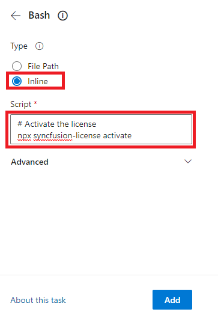
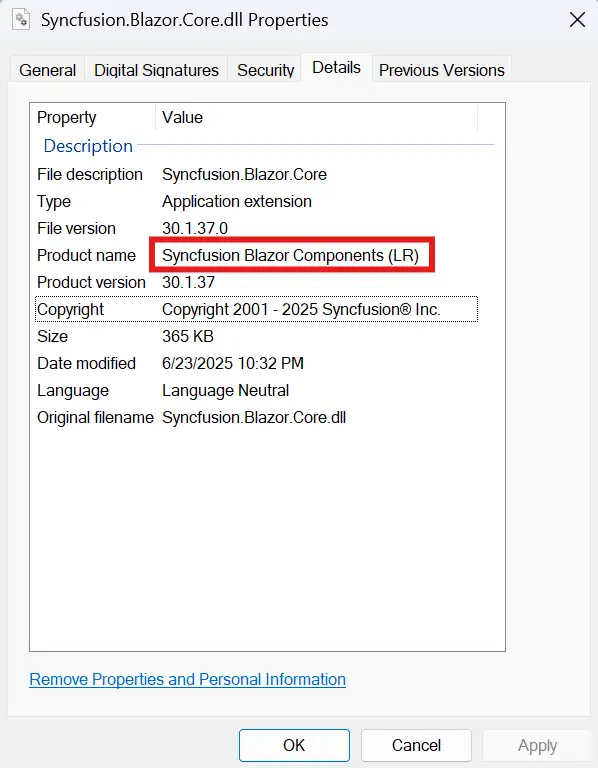
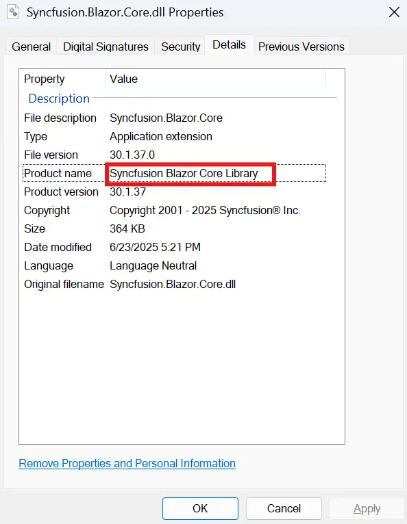

# License Key Registration

The generated Syncfusion<sup style="font-size:70%">&reg;</sup> license key is a string that must be registered before any Syncfusion<sup style="font-size:70%">&reg;</sup> control is initialized. The registration method depends on the platform your application uses.

> **Note:** Syncfusion<sup style="font-size:70%">&reg;</sup> license validation is performed offline during application execution and does not require an internet connection. Applications registered with a valid Syncfusion<sup style="font-size:70%">&reg;</sup> license key can be deployed on systems without internet access. However, the initial `npx syncfusion-license activate` step does require internet access.

Select your platform below to view the appropriate registration steps.

* [Angular](#angular)
* [ReactJS](#react)
* [Vue](#vue)
* [JavaScript (ES5)](#javascript-es5)
* [TypeScript](#typescript)
* [ASP.NET Core](#aspnet-core)
* [ASP.NET MVC](#aspnet-mvc)
* [Blazor](#blazor)
* [WPF](#wpf)
* [UWP](#uwp)
* [WinUI](#winui)
* [.NET MAUI](#net-maui)

## Angular

A Syncfusion<sup style="font-size:70%">&reg;</sup> license key must be registered when your project references Syncfusion<sup style="font-size:70%">&reg;</sup> EJ2-Angular packages. The generated license key is a string that should be registered after adding any [Syncfusion<sup style="font-size:70%">&reg;</sup> Angular reference](https://ej2.syncfusion.com/angular/documentation/getting-started/angular-cli#create-a-new-application).

Generate the [Syncfusion<sup style="font-size:70%">&reg;</sup> license key](https://ej2.syncfusion.com/angular/documentation/licensing/license-key-generation) and register it in one of the following ways:

* [Register the license key in the project](#register-the-license-key-in-the-project)
* [Register the license key using the npx command](#register-the-license-key-using-the-npx-command)

### Register the license key in the project

Register the license key in the `main.ts` file of the Angular project. Place the registration call before bootstrapping the application so the license is available during runtime.

```typescript
import { enableProdMode } from '@angular/core';
import { platformBrowserDynamic } from '@angular/platform-browser-dynamic';

import { AppModule } from './app/app.module';
import { environment } from './environments/environment';
import { registerLicense } from '@syncfusion/ej2-base';

// Registering Syncfusion license key
registerLicense('Replace your generated license key here');

if (environment.production) {
  enableProdMode();
}

platformBrowserDynamic().bootstrapModule(AppModule)
  .catch(err => console.error(err));
```

> **Note:** License key registration is required from 2022 Vol 1 v20.1.0.47 onwards for Essential<sup style="font-size:70%">&reg;</sup> JavaScript 2 products.

### Register the license key using the npx command

Register the Syncfusion<sup style="font-size:70%">&reg;</sup> license key through the `npx` command in one of the following ways:

* [Register the license key with the license file](#register-the-license-key-with-the-license-file)
* [Register the license key with the environment variable](#register-the-license-key-with-the-environment-variable)

> If both the license text file and the environment variable are used for license registration, priority is given to the `syncfusion-license.txt` file. To use the environment variable for license registration, remove the license text file from the application.

#### Register the license key with the license file

The following steps show how to register the Syncfusion<sup style="font-size:70%">&reg;</sup> license key with the license text file.

1. Create the `syncfusion-license.txt` file in the application root directory and paste the license key.
2. Open the command prompt in the application root directory and activate the license key using the following command:

    ```sh
    npx syncfusion-license activate
    ```

3. Once the Syncfusion<sup style="font-size:70%">&reg;</sup> license key is activated, the following console message will appear.

    **License message:** <br /> (INFO) Syncfusion<sup style="font-size:70%">&reg;</sup> License imported successfully.

4. Remove the `.cache` folder from `node_modules` in the application.
5. Run the application. If you encounter a license validation error, refer to this [link](./licensing-error) to resolve it. For frequently asked license registration questions, refer to this [link](./licensing-troubleshoot).

> If you don't want to use the license text file in the application, refer to this [link](#register-the-license-key-with-the-environment-variable) to use an environment variable and register the Syncfusion<sup style="font-size:70%">&reg;</sup> license key. Also, check out some common licensing FAQs while registering the license key using the npx command from this [link](https://ej2.syncfusion.com/angular/documentation/licensing/licensing-troubleshoot#Reactivating-license-once-after-updating-the-package-version-while-using-npx).

#### Register the license key with the environment variable

Set the environment variable as `SYNCFUSION_LICENSE` in the system with the license key as its value. It can be used in all applications on your machine.

##### Windows

Open the command prompt and use the [setx](https://learn.microsoft.com/en-us/windows-server/administration/windows-commands/setx) command to add the new environment variable.

```sh
setx SYNCFUSION_LICENSE "license key"
```

##### Mac

* Open the terminal and use the `env` command to view the variables list.
* Set the environment variable using the following command:

    ```sh
    echo 'export SYNCFUSION_LICENSE="license key"' >> ~/.bash_profile
    ```

* To modify the environment variable in the bash profile, use the following command:

    ```sh
    nano .bash_profile
    ```

* Once modified, press `Ctrl+X` to exit, then `Y` and `Enter` to save the changes.
* Close the terminal and reopen it to verify the environment variable changes using the `env` command.

##### Linux

* Open the terminal and use the `env` command to view the variables list.
* Set or modify the [environment variable](https://help.ubuntu.com/community/EnvironmentVariables) using the following command:

    ```sh
    export SYNCFUSION_LICENSE='license key'
    ```

* Once the `SYNCFUSION_LICENSE` environment variable is set, restart the IDE or application terminal before using the license activation command.
* Open the command prompt in the application root directory and activate the license key using the following command:

    ```sh
    npx syncfusion-license activate
    ```

* Once the Syncfusion<sup style="font-size:70%">&reg;</sup> license key is activated, the following console message will appear.

    **License message:** <br /> (INFO) Syncfusion<sup style="font-size:70%">&reg;</sup> License imported successfully.

* Remove the `.cache` folder from `node_modules` in the application.
* Run the application. If you encounter a license validation error, refer to this [link](./licensing-error) to resolve it. For frequently asked license registration questions, refer to this [link](./licensing-troubleshoot).

### Register the license key in CI services

The following sections show how to use an environment variable in CI services.

#### GitHub Actions

* Create a [new Repository Secret](https://docs.github.com/en/actions/security-for-github-actions/security-guides/using-secrets-in-github-actions#creating-encrypted-secrets-for-a-repository) or an [Organization Secret](https://docs.github.com/en/actions/security-for-github-actions/security-guides/using-secrets-in-github-actions#creating-encrypted-secrets-for-an-organization). Set the name of the secret to `SYNCFUSION_LICENSE` and use the license key as the value.
* Add the Syncfusion<sup style="font-size:70%">&reg;</sup> license activation command after running `npm install` or `yarn`:

  ```yaml
  steps:
  - name: Install node modules
    run: npm install

  - name: Activate Syncfusion License
    run: npx syncfusion-license activate
    env:
      SYNCFUSION_LICENSE: ${{ secrets.SYNCFUSION_LICENSE }}
  ```

#### Azure Pipelines (YAML)

* Create a new [User-defined Variable](https://docs.microsoft.com/en-us/azure/devops/pipelines/process/variables?view=azure-devops&tabs=yaml%2Cbatch) named `SYNCFUSION_LICENSE`. Use the license key as the value.
* Add the Syncfusion<sup style="font-size:70%">&reg;</sup> license activation command after running `npm install` or `yarn`.

The following example shows the syntax for Windows build agents.

```yaml
pool:
  vmImage: 'windows-latest'

steps:
- script: call npm install
  displayName: 'Install node modules'

- script: call npx syncfusion-license activate
  displayName: 'Activate Syncfusion License'
  env:
    SYNCFUSION_LICENSE: $(SYNCFUSION_LICENSE)
```

The following example shows the syntax for Linux build agents.

```yaml
pool:
  vmImage: 'ubuntu-latest'

steps:
- script: npm install
  displayName: 'Install node modules'

- script: npx syncfusion-license activate
  displayName: 'Activate Syncfusion License'
  env:
    SYNCFUSION_LICENSE: $(SYNCFUSION_LICENSE)
```

#### Azure Pipelines (Classic)

* Create a new [User-defined Variable](https://docs.microsoft.com/en-us/azure/devops/pipelines/process/variables?view=azure-devops&tabs=yaml%2Cbatch) named `SYNCFUSION_LICENSE`. Use the license key as the value.
* Add the Syncfusion<sup style="font-size:70%">&reg;</sup> license activation command after running `npm install` or `yarn` using a Bash task:

  ```bash
  # Activate the license
  npx syncfusion-license activate
  ```



### Register multiple license keys (Angular)

If you need to register multiple Syncfusion<sup style="font-size:70%">&reg;</sup> license keys in your application, separate each key with a semicolon.

**Format:** `key1;key2;key3`

**Example:**

```ts
registerLicense('license-key-1-here;license-key-2-here');
```

> When registering multiple keys, ensure there are no spaces before or after the semicolon separator.

## React

A Syncfusion<sup style="font-size:70%">&reg;</sup> license key must be registered if your project references Syncfusion<sup style="font-size:70%">&reg;</sup> EJ2-React packages. The generated license key is a string that should be registered after adding any [Syncfusion<sup style="font-size:70%">&reg;</sup> React reference](https://ej2.syncfusion.com/react/documentation/getting-started/quick-start).

Generate the [Syncfusion<sup style="font-size:70%">&reg;</sup> license key](https://ej2.syncfusion.com/react/documentation/licensing/license-key-generation) and register it in one of the following ways:

* [Register the license key in the project](#register-the-license-key-in-the-project-1)
* [Register the license key using the npx command](#register-the-license-key-using-the-npx-command-1)

### Register the license key in the project

Register the license key in the `index.js` file of the React project. Place the registration call before rendering the root component.

```js
import React from 'react';
import ReactDOM from 'react-dom/client';
import './index.css';
import App from './App';
import reportWebVitals from './reportWebVitals';
import { registerLicense } from '@syncfusion/ej2-base';

// Registering Syncfusion license key
registerLicense('Replace your generated license key here');

const root = ReactDOM.createRoot(document.getElementById('root'));
root.render(
  <React.StrictMode>
    <App />
  </React.StrictMode>
);

reportWebVitals();
```

> **Note:** License key registration is required from 2022 Vol 1 v20.1.0.47 onwards for Essential<sup style="font-size:70%">&reg;</sup> JavaScript 2 products.

### Register the license key using the npx command

The `npx` registration flow for React is identical to the Angular flow. See [Register the license key using the npx command](#register-the-license-key-using-the-npx-command) above.

### Register multiple license keys (React)

```ts
registerLicense('license-key-1-here;license-key-2-here');
```

## Vue

A Syncfusion<sup style="font-size:70%">&reg;</sup> license key must be registered if your project references Syncfusion<sup style="font-size:70%">&reg;</sup> Vue packages. The generated license key is a string that needs to be registered after any [Syncfusion<sup style="font-size:70%">&reg;</sup> Vue reference](https://ej2.syncfusion.com/vue/documentation/getting-started/vue-3-js-composition).

Generate the [Syncfusion<sup style="font-size:70%">&reg;</sup> license key](https://ej2.syncfusion.com/vue/documentation/licensing/license-key-generation) and register it using one of the following methods:

* [Register the license key in the project](#register-the-license-key-in-the-project-2)
* [Register the license key in the Nuxt project](#register-the-license-key-in-the-nuxt-project)
* [Register the license key using the npx command](#register-the-license-key-using-the-npx-command-2)

### Register the license key in the project

Register the license key in the `main.js` file of the Vue project.

```ts
import { createApp } from 'vue'
import App from './App.vue'
import { registerLicense } from '@syncfusion/ej2-base';

// Registering Syncfusion license key
registerLicense('Replace your generated license key here');

createApp(App).mount('#app')
```

### Register the license key in the Nuxt project

Register the license key in the `app.vue` file of the Nuxt project.

```html
<script>
import { registerLicense } from '@syncfusion/ej2-base';

// Registering Syncfusion license key
registerLicense('Replace your generated license key here');
</script>
```

### Register the license key using the npx command

The `npx` registration flow for Vue is identical to the Angular flow. See [Register the license key using the npx command](#register-the-license-key-using-the-npx-command) above.

### Register multiple license keys (Vue)

```ts
registerLicense('license-key-1-here;license-key-2-here');
```

> When registering multiple keys, ensure there are no spaces before or after the semicolon separator.

## JavaScript (ES5)

The Syncfusion<sup style="font-size:70%">&reg;</sup> license key must be registered in projects that reference Syncfusion<sup style="font-size:70%">&reg;</sup> JavaScript (ES5) packages. The generated license key is a string that must be registered after including any [Syncfusion<sup style="font-size:70%">&reg;</sup> JavaScript (ES5) script reference](https://ej2.syncfusion.com/javascript/documentation/getting-started/quick-start).

> **Note:** As we have mandated license registration for the Syncfusion<sup style="font-size:70%">&reg;</sup> JavaScript components, we acknowledge that there is a possibility for the registered Syncfusion<sup style="font-size:70%">&reg;</sup> license key to be viewed from your application by others. This is unavoidable on the JavaScript platform, as there is minimal scope for hiding the license key. We recommend not advertising the key publicly.

### Register the license key in the project

Register the license key by using the `registerLicense` method after the [Syncfusion<sup style="font-size:70%">&reg;</sup> JavaScript script](https://ej2.syncfusion.com/javascript/documentation/getting-started/quick-start) file reference:

```ts
// Registering Syncfusion license key
ej.base.registerLicense('Replace your generated license key here');
```

> **Note:** License key registration is required from 2022 Vol 1 v20.1.0.47 onwards for Essential<sup style="font-size:70%">&reg;</sup> JavaScript 2 products.

### Register multiple license keys (JavaScript ES5)

```ts
ej.base.registerLicense('license-key-1-here;license-key-2-here');
```

> When registering multiple keys, ensure there are no spaces before or after the semicolon separator.

## TypeScript

A Syncfusion<sup style="font-size:70%">&reg;</sup> license key must be registered if your project references Syncfusion<sup style="font-size:70%">&reg;</sup> EJ2-TypeScript packages. The generated license key is a string that should be registered at the entry point of the project before using any Syncfusion<sup style="font-size:70%">&reg;</sup> control.

Generate the [Syncfusion<sup style="font-size:70%">&reg;</sup> license key](https://ej2.syncfusion.com/javascript/documentation/licensing/license-key-generation) and register it using one of the following ways:

* [Register the license key in the project](#register-the-license-key-in-the-project-3)
* [Register the license key using the npx command](#register-the-license-key-using-the-npx-command-3)

### Register the license key in the project

Register the license key at the entry point of the TypeScript project before using any Syncfusion<sup style="font-size:70%">&reg;</sup> control.

```ts
// Registering Syncfusion license key
import { registerLicense } from '@syncfusion/ej2-base';

registerLicense('Replace your generated license key here');
```

### Register the license key using the npx command

The `npx` registration flow for TypeScript is identical to the Angular flow. See [Register the license key using the npx command](#register-the-license-key-using-the-npx-command) above.

### Register multiple license keys (TypeScript)

```ts
registerLicense('license-key-1-here;license-key-2-here');
```

## ASP.NET Core

Register the license key in the `Configure` method of `Startup.cs` (for .NET 5 and earlier) or in `Program.cs` (for .NET 6 and later).

### .NET 6 and later (Program.cs)

```csharp
var builder = WebApplication.CreateBuilder(args);

// Register the Syncfusion license
Syncfusion.Licensing.SyncfusionLicenseProvider.RegisterLicense("YOUR LICENSE KEY");

var app = builder.Build();

// Configure the HTTP request pipeline.
if (!app.Environment.IsDevelopment())
{
    app.UseExceptionHandler("/Home/Error");
    app.UseHsts();
}
```

### .NET 5 and earlier (Startup.cs)

```csharp
// This method gets called by the runtime. Use this method to configure the HTTP request pipeline.
public void Configure(IApplicationBuilder app, IHostingEnvironment env, ILoggerFactory loggerFactory)
{
    // Register Syncfusion license
    Syncfusion.Licensing.SyncfusionLicenseProvider.RegisterLicense("YOUR LICENSE KEY");

    loggerFactory.AddConsole(Configuration.GetSection("Logging"));
    loggerFactory.AddDebug();

    // ...other configuration
}
```

> Place the license key between double quotes. Also, ensure that `Syncfusion.Licensing.dll` is referenced in your project where the license key is being registered.

## ASP.NET MVC

Register the license key in the `Application_Start` method of `Global.asax.cs` (C#) or `Global.asax.vb` (Visual Basic).

### C#

```csharp
void Application_Start(object sender, EventArgs e)
{
    // Register Syncfusion license
    Syncfusion.Licensing.SyncfusionLicenseProvider.RegisterLicense("YOUR LICENSE KEY");

    // Code that runs on application startup
    RouteConfig.RegisterRoutes(RouteTable.Routes);
    BundleConfig.RegisterBundles(BundleTable.Bundles);
}
```

### Visual Basic

```vb
Protected Sub Application_Start()
    ' Syncfusion Licensing Register
    Syncfusion.Licensing.SyncfusionLicenseProvider.RegisterLicense("YOUR LICENSE KEY")
    AreaRegistration.RegisterAllAreas()
    Register(GlobalConfiguration.Configuration)
    FilterConfig.RegisterGlobalFilters(GlobalFilters.Filters)
    RouteConfig.RegisterRoutes(RouteTable.Routes)
    BundleConfig.RegisterBundles(BundleTable.Bundles)
End Sub
```

## Blazor

License registration requirements vary depending on the project type. The following sections cover the supported Blazor application types, registering the license in a Razor Class Library, and the recommended secure-registration approach for Blazor WebAssembly apps.

### Register License Key in Blazor Application

I> Syncfusion<sup style="font-size:70%">&reg;</sup> license keys can be validated during the Continuous Integration (CI) processes to ensure proper licensing and prevent licensing errors during deployment. Refer to the [CI License Validation](./ci-license-validation) section for detailed instructions on how to implement it.

Use the following table to determine where to register the license key based on the Blazor hosting model.

| Blazor mode                          | Projects to register the license key     | Files to register the license key        |
|--------------------------------------|------------------------------------------|------------------------------------------|
| Blazor Web App (Interactive Auto)    | Server and client                        | `Server/Program.cs`, `Client/Program.cs` |
| Blazor Web App (Interactive Server)  | Server                                   | `Server/Program.cs`                      |
| Blazor Web App (Interactive WASM)    | Server and client                        | `Server/Program.cs`, `Client/Program.cs` |
| Blazor Standalone WebAssembly App    | Client                                   | `Program.cs`                             |

#### Blazor Web App (Interactive Auto)

Open the `~/Program.cs` file in **both the server and client projects** of a Blazor Web App (Interactive Auto) and register the Syncfusion<sup style="font-size:70%">&reg;</sup> Blazor license key.

```csharp
// Register the Syncfusion license
Syncfusion.Licensing.SyncfusionLicenseProvider.RegisterLicense("YOUR LICENSE KEY");
```

#### Blazor Web App (Interactive Server)

For .NET 8, .NET 9, and .NET 10, open the `~/Program.cs` file and register the Syncfusion<sup style="font-size:70%">&reg;</sup> license key.

```csharp
var app = builder.Build();

// Register the Syncfusion license
Syncfusion.Licensing.SyncfusionLicenseProvider.RegisterLicense("YOUR LICENSE KEY");

// Configure the HTTP request pipeline.
if (!app.Environment.IsDevelopment())
{
    app.UseExceptionHandler("/Home/Error");
    // The default HSTS value is 30 days. You may want to change this for production scenarios, see https://aka.ms/aspnetcore-hsts.
    app.UseHsts();
}
```

#### Blazor Web App (Interactive WebAssembly)

Open the `~/Program.cs` file in **both the server and client projects** of a Blazor Web App (Interactive WebAssembly) and register the Syncfusion<sup style="font-size:70%">&reg;</sup> Blazor license key.

```csharp
// Register the Syncfusion license
Syncfusion.Licensing.SyncfusionLicenseProvider.RegisterLicense("YOUR LICENSE KEY");
```

#### Blazor Standalone WebAssembly App

Open the `~/Program.cs` file and register the Syncfusion<sup style="font-size:70%">&reg;</sup> Blazor license key in the client web app.

```csharp
// Register the Syncfusion license
Syncfusion.Licensing.SyncfusionLicenseProvider.RegisterLicense("YOUR LICENSE KEY");

var builder = WebAssemblyHostBuilder.CreateDefault(args);

// ...other configuration
```

### Register License Key in a Razor Class Library Application

Register the Syncfusion<sup style="font-size:70%">&reg;</sup> license key before any Syncfusion<sup style="font-size:70%">&reg;</sup> Blazor component is initialized. Place the key in the Razor Class Library (RCL) project so every consuming app inherits the registration.

```csharp
Syncfusion.Licensing.SyncfusionLicenseProvider.RegisterLicense("YOUR LICENSE KEY");
```

> * Place the license key between double quotes. Also, ensure that `Syncfusion.Licensing.dll` is referenced in your project where the license key is being registered.
> * Syncfusion<sup style="font-size:70%">&reg;</sup> license validation is done offline during application execution and does not require internet access. Apps registered with a Syncfusion<sup style="font-size:70%">&reg;</sup> license key can be deployed on any system that does not have an internet connection.

If the RCL references Syncfusion Blazor packages from [nuget.org](https://www.nuget.org/packages?q=syncfusion) or from the trial installer, register the license key in the RCL before packaging or referencing it. The registration pattern mirrors the approach used in Blazor Apps (Server or WebAssembly).

For setup guidance, see [Getting started with Syncfusion Blazor in a Razor Class Library](https://blazor.syncfusion.com/documentation/getting-started/razor-class-library).

#### Blazor Web App (RCL consumer)

Open the `~/Program.cs` file of the consuming Blazor web app and register the Syncfusion<sup style="font-size:70%">&reg;</sup> Blazor license key.

```csharp
// Register the Syncfusion license
Syncfusion.Licensing.SyncfusionLicenseProvider.RegisterLicense("YOUR LICENSE KEY");
```

#### Blazor Server App (RCL consumer)

After referencing the RCL from a Blazor Server application, register the license key in `Program.cs`. For .NET 8, .NET 9, and .NET 10 apps, open `~/Program.cs` and register the Syncfusion<sup style="font-size:70%">&reg;</sup> license key.

```csharp
var app = builder.Build();
// Register the Syncfusion license
Syncfusion.Licensing.SyncfusionLicenseProvider.RegisterLicense("YOUR LICENSE KEY");

// Configure the HTTP request pipeline.
if (!app.Environment.IsDevelopment())
{
    app.UseExceptionHandler("/Home/Error");
    // The default HSTS value is 30 days. You may want to change this for production scenarios, see https://aka.ms/aspnetcore-hsts.
    app.UseHsts();
}
```

#### Blazor WebAssembly App (RCL consumer)

After referencing the RCL from a Blazor WebAssembly application, register the license key in `Program.cs`.

```csharp
// Register the Syncfusion license
Syncfusion.Licensing.SyncfusionLicenseProvider.RegisterLicense("YOUR LICENSE KEY");
```

> Refer to [Getting started with RCL in Blazor Server and Blazor WebAssembly](https://blazor.syncfusion.com/documentation/getting-started/razor-class-library) for more information.

### How to Register Syncfusion License Key Securely in Blazor WASM App

Registering a license key directly in the `Program.cs` file of a Blazor WebAssembly client project can expose it through the compiled assemblies, making it accessible in the browser and creating security risks.

#### Recommended Solution: Use Licensed NuGet Packages

Syncfusion<sup style="font-size:70%">&reg;</sup> recommends using licensed NuGet packages distributed with licensed Blazor releases (volume and service pack). When these licensed packages are used, no license key registration is required in application code.

**Benefits of using licensed NuGet packages:**

- **Enhanced Security:** Prevents license key exposure in the browser.
- **Simplified Deployment:** Removes the need for manual license key registration.

Refer to the Blazor web installer documentation to download and install the licensed Blazor product:

* [Download instructions](https://blazor.syncfusion.com/documentation/installation/web-installer/how-to-download)
* [Installation guide](https://blazor.syncfusion.com/documentation/installation/web-installer/how-to-install)

#### Using licensed NuGet packages

Build your Blazor WASM application using licensed NuGet packages from these sources:

* **Local Folder:** Store packages locally and configure your project for restoration.
* **Private repository manager:** Host and manage packages using a private NuGet repository manager such as Nexus or an Azure DevOps Artifacts feed.

> **Important:** When referencing both a local folder or private repository and `nuget.org` in `NuGet.config`, and if both sources contain the same Syncfusion<sup style="font-size:70%">&reg;</sup> package version, restore may default to `nuget.org` (trial versions), which can cause license popup issues.

#### Use Package Source Mapping

To ensure the project always restores Syncfusion<sup style="font-size:70%">&reg;</sup> packages from the licensed source, configure [Package Source Mapping](https://learn.microsoft.com/en-us/nuget/consume-packages/package-source-mapping) in `NuGet.config`.

```xml
<configuration>
  <packageSources>
    <add key="licensed-nuget" value="path/to/your/nuget-source" />
    <add key="nuget.org" value="https://api.nuget.org/v3/index.json" />
  </packageSources>
  <packageSourceMapping>
    <packageSource key="licensed-nuget">
      <package pattern="Syncfusion.*" />
    </packageSource>
  </packageSourceMapping>
</configuration>
```

#### Verifying assembly licensing

To confirm whether your application is referencing licensed or trial assemblies:

1. Navigate to the build output directory and locate the Syncfusion<sup style="font-size:70%">&reg;</sup> assemblies.
2. Right-click each assembly, select **Properties**, then go to the **Details** tab.
3. Check the **File Description**:

    * If the file description includes **"LR"**, it is a **trial** version.
        
    * If it does **not** include **"LR"**, it is a **licensed** version.
        

If trial assemblies are detected, follow these steps to ensure a clean and licensed setup:

* Clear the NuGet cache to remove any previously downloaded trial packages:

    ```bash
    dotnet nuget locals all --clear
    ```

* Delete the `bin` and `obj` folders from project directories to remove cached build artifacts.
* Uninstall and reinstall the Syncfusion<sup style="font-size:70%">&reg;</sup> packages, ensuring restore pulls only from the licensed NuGet source.

#### Securely manage Syncfusion<sup style="font-size:70%">&reg;</sup> license keys using Azure Key Vault

You can integrate Azure Key Vault into your application to retrieve the license key at runtime, ensuring it is never exposed in the browser or stored in the client-side code. This method keeps sensitive information out of your source code and configuration files.

For detailed steps, see [Securely store and use Syncfusion license keys in Azure Key Vault](https://help.syncfusion.com/common/essential-studio/licensing/licensing-faq/how-to-securely-store-and-use-syncfusion-license-keys-in-azure-key-vault).

## WPF

Register the license key in the `App` constructor of `App.xaml.cs` (C#) or `App.xaml.vb` (Visual Basic). If the `App` constructor is not available, create it and register the license key inside the constructor.

### C#

```csharp
public partial class App : Application
{
    public App()
    {
        // Register Syncfusion license
        Syncfusion.Licensing.SyncfusionLicenseProvider.RegisterLicense("YOUR LICENSE KEY");
    }
}
```

### Visual Basic

```vb
Private Sub New()
    ' Register Syncfusion License
    Syncfusion.Licensing.SyncfusionLicenseProvider.RegisterLicense("YOUR LICENSE KEY")
End Sub
```


## UWP

Register the license key in the `App.xaml.cs` constructor before `InitializeComponent()` (C#) or in `App.xaml.vb` (Visual Basic) before the `OnLaunched` event.

### C#

```csharp
public App()
{
    // Register Syncfusion license
    Syncfusion.Licensing.SyncfusionLicenseProvider.RegisterLicense("YOUR LICENSE KEY");

    this.InitializeComponent();
    this.Suspending += OnSuspending;
}
```

### Visual Basic

```vb
Public Sub New()
    ' Register Syncfusion License
    Syncfusion.Licensing.SyncfusionLicenseProvider.RegisterLicense("YOUR LICENSE KEY")
End Sub

Protected Overrides Sub OnLaunched(e As Windows.ApplicationModel.Activation.LaunchActivatedEventArgs)
    ' ...other configuration
End Sub
```

## WinUI

Register the license key in the `App.xaml.cs` constructor of the WinUI application before initializing any Syncfusion<sup style="font-size:70%">&reg;</sup> control.

```csharp
public App()
{
    // Register Syncfusion license
    Syncfusion.Licensing.SyncfusionLicenseProvider.RegisterLicense("YOUR LICENSE KEY");

    this.InitializeComponent();
}
```

If the `App` constructor is not available, create it and register the license key inside the constructor.

## .NET MAUI

In .NET MAUI, the license key can be registered using either of two approaches.

### 1. Register the license key in App.xaml.cs

Register the license key in the `App.xaml.cs` constructor before `InitializeComponent()`. If the `App()` constructor is not available, create it and register the license key inside the constructor.

```csharp
public App()
{
    // Register Syncfusion license
    Syncfusion.Licensing.SyncfusionLicenseProvider.RegisterLicense("YOUR LICENSE KEY");

    InitializeComponent();

    MainPage = new AppShell();
}
```

### 2. Register the license key in MauiProgram.cs

Register the license key in `MauiProgram.cs` when initializing or registering any Syncfusion<sup style="font-size:70%">&reg;</sup> controls within this file. This ensures that all controls are fully licensed and functional from the moment the application starts. Add the license registration code inside the `CreateMauiApp` method in `MauiProgram.cs`.

```csharp
public static class MauiProgram
{
    public static MauiApp CreateMauiApp()
    {
        // Register the Syncfusion license key
        Syncfusion.Licensing.SyncfusionLicenseProvider.RegisterLicense("YOUR_LICENSE_KEY");

        var builder = MauiApp.CreateBuilder();
        builder
            .UseMauiApp<App>()
            .ConfigureSyncfusionCore()
            .ConfigureFonts(fonts =>
            {
                fonts.AddFont("OpenSans-Regular.ttf", "OpenSansRegular");
            });

        return builder.Build();
    }
}
```

## See Also

* [License Key Generation](license-key-generation)
* [Licensing Overview](overview)
* [Licensing FAQ](licensing-troubleshoot)
* [Licensing Errors](licensing-error)
