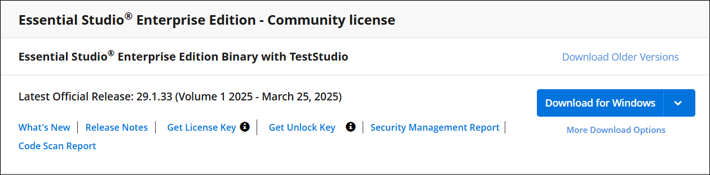
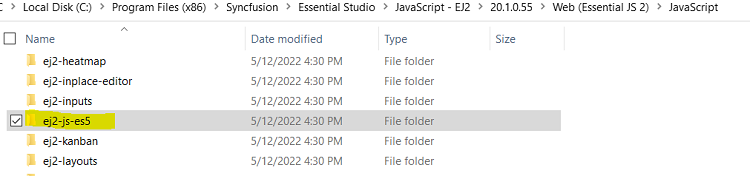
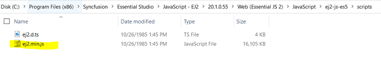
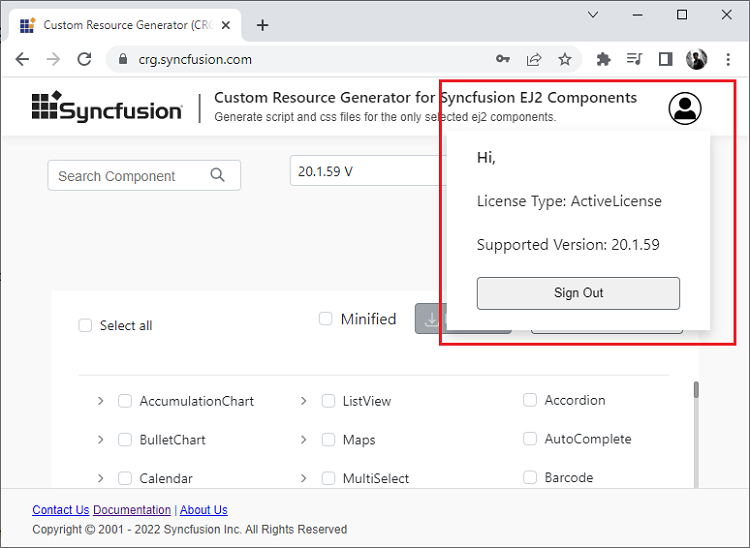
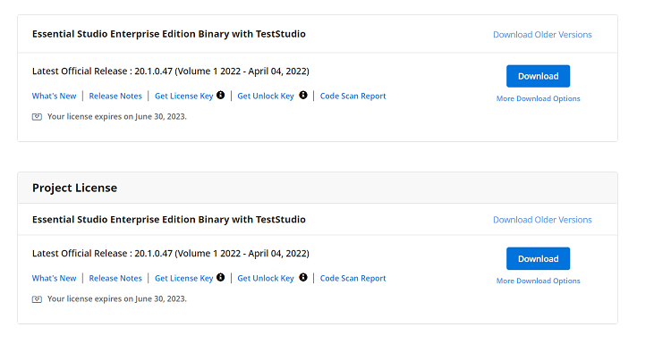

# Syncfusion® Gantt SDK Licensing FAQ & Troubleshooting

This page answers the most frequently asked questions about Syncfusion<sup style="font-size:70%">&reg;</sup> Gantt SDK license key validation, registration, and upgrades. If you cannot find an answer here, refer to the [licensing overview](./overview), [license key generation](./license-key-generation), [license key registration](./license-key-registration), or [licensing errors](./licensing-error) pages.

## Is an internet connection required for license validation?

No, an internet connection is **not** required for the Syncfusion<sup style="font-size:70%">&reg;</sup> Essential Studio<sup style="font-size:70%">&reg;</sup> license validation. The Syncfusion<sup style="font-size:70%">&reg;</sup> license validation is done **offline** during application execution. Apps registered with a valid Syncfusion<sup style="font-size:70%">&reg;</sup> license key can be deployed on any system that does not have an internet connection.

> The initial `npx syncfusion-license activate` step does require an internet connection to retrieve the key for the first time. Refer to the [license key registration guide](./license-key-registration) for details.

## Upgrade from the trial version after purchasing a license

To upgrade from the trial version, there are two possible solutions:

* Uninstall the trial version and install the fully licensed build from the [License & Downloads](https://www.syncfusion.com/account/downloads) section of the Syncfusion<sup style="font-size:70%">&reg;</sup> website.
* If you are using Syncfusion<sup style="font-size:70%">&reg;</sup> controls from the [npm](https://www.npmjs.com/search?q=scope:syncfusion) or [NuGet](https://www.nuget.org/packages?q=syncfusion) registries, replace the currently used trial license key with a paid license key that can be generated from the [License & Downloads](https://www.syncfusion.com/account/downloads) section of the Syncfusion<sup style="font-size:70%">&reg;</sup> website. Refer to the [license key registration guide](./license-key-registration) for information on registering the license in the application.

> License registration is not required if you reference Syncfusion<sup style="font-size:70%">&reg;</sup> scripts from the licensed installer. These licensing changes apply to all evaluators who refer to the Syncfusion<sup style="font-size:70%">&reg;</sup> scripts from the evaluation installer and those who use the Syncfusion<sup style="font-size:70%">&reg;</sup> NuGet packages from [nuget.org](https://www.nuget.org/).

## Where can I get a license key?

License keys can be generated from the [License & Downloads](https://www.syncfusion.com/account/downloads) or the [Trial & Downloads](https://www.syncfusion.com/account/manage-trials/downloads) section of the Syncfusion<sup style="font-size:70%">&reg;</sup> website.



The Syncfusion<sup style="font-size:70%">&reg;</sup> license keys are version and platform-specific. Refer to the [KB](https://www.syncfusion.com/kb/8976/how-to-generate-license-key-for-licensed-products) to generate the license key for the required version and platform. Also, refer to this [KB](https://www.syncfusion.com/kb/8951/which-version-syncfusion-license-key-should-i-use-in-my-application) to know which version of the Syncfusion<sup style="font-size:70%">&reg;</sup> license key should be used in the application.

> When using ASP.NET Core controls together with JavaScript (ES5) components, register the license key in **both** the JavaScript (ES5) client side and the [ASP.NET Core](./license-key-registration#asp-net-core) server side. License validation occurs on the client for JavaScript (ES5) components and on the server for ASP.NET Core components.

## Refer to EJ2 scripts without registering the license key

Registering the Syncfusion<sup style="font-size:70%">&reg;</sup> license key in the application is mandated from version 20.1 for all the Syncfusion<sup style="font-size:70%">&reg;</sup> EJ2 platforms to avoid licensing warnings. End users can easily inspect the license key registered in the script due to the nature of JavaScript. If you are a licensed customer and do not want to expose your key for security or other reasons, use one of the following approaches to reference the scripts without registering the license key in the application.

### Using scripts from the licensed installer

License registration is **not** required for licensed users when referring to scripts from a [licensed installer](https://www.syncfusion.com/account/downloads). The following steps guide you to get the installed script from your machine.

1. After installing the licensed build from a licensed installer, go to the installed location and navigate to `EJ2/Installed Version/Web (Essential JS 2)/JavaScript/ej2-js-es5`.

    

2. Navigate to the `ej2-js-es5` package folder and access the `ej2.min.js` from the `scripts` folder. Use this minified EJ2 script in your application.

    

### Using scripts from the Custom Resource Generator (CRG)

If you are a licensed customer, you can download scripts from the [CRG](https://crg.syncfusion.com/), which does not require license registration, by signing in with the Syncfusion<sup style="font-size:70%">&reg;</sup> account. You can check your license status by clicking the **My Account** icon as follows.



Refer to the [CRG documentation](https://ej2.syncfusion.com/javascript/documentation/common/custom-resource-generator) for more information on how to refer to scripts.

## Does a registered license key expire?

No, the Syncfusion<sup style="font-size:70%">&reg;</sup> license keys do not expire for a particular version, and you can continue to use them. You will not face any problems on the live site. If you have used the trial key, it will expire in 30 days, and we do not recommend using it in production.

> If you upgrade to newer versions of the Syncfusion<sup style="font-size:70%">&reg;</sup> packages, you have to generate new license keys and use them.

## When to generate a new license key while upgrading

You do not need to generate or change license keys for minor version upgrades. However, when upgrading from one major version to another major version, you must generate a new license key and update it in your application.

For example:

* If you are using a version like `25.1.X`, it is important to use the same version for all Syncfusion<sup style="font-size:70%">&reg;</sup> components in your application. The license key generated for version `25.X.XX` can be used. This key can be used across all minor versions within that major version, `v25`. This means you can upgrade all packages to `25.2.X` while still using the same license key.
* However, if you upgrade from one major version to another—such as from `25.1.X` to `26.1.X`—you will need to generate a new license key for the latest version and update it in your application.

> The guidelines above do not apply to packages on version `20.X.XX`, where `20.1` denotes one major version and `20.2` another major version. Starting with release version 21, the pattern has been adjusted. So if you are using `20.1.X` and upgrade to `20.2.X`, you must generate new license keys for `20.2.X` and update them in the application. These guidelines apply to versions 21 and later.

## License registration for multiple developers on your project

The Syncfusion<sup style="font-size:70%">&reg;</sup> license key is version-based and is not tied to a specific developer. You do not have to register different keys for each developer. Just register one valid license key when developing and publishing the software.

## Can I use the same key for all the web apps under the project?

Yes. One valid license key covers all web applications within the licensed project or scope.

## Does the license registration access any resources or data?

No. License registration and validation are performed **locally and offline** without accessing external resources or sending data. Refer to the [Licensing Overview](./overview#privacy-assurance) for more information.

## License & Downloads shows the "Essential Studio<sup style="font-size:70%">&reg;</sup> Enterprise Edition Binary with Test Studio" and the "Project License". Which license should I use?

Use any licenses shown on the [accounts & downloads](https://www.syncfusion.com/account/downloads) page. Two licenses are shown when you are part of your company's enterprise portal global license and an individual license is also assigned to your account. In that case, both the individual license and your enterprise portal global license are displayed.



For definitions of Syncfusion<sup style="font-size:70%">&reg;</sup> license types, refer to this [KB article on license terms](https://www.syncfusion.com/kb/11532/definition-of-terms-for-syncfusion-licenses).

## If I registered the license key in both the application and the license text file, which one is used?

When the license key is registered in both the application code and the `license.txt` file, the **application-registered license key** takes priority and is used for license validation.

## Reactivating the license after updating the package version (npx registration)

If you registered the license key through the `npx syncfusion-license activate` command, it is **necessary** to **reactivate the license key** every time you upgrade the Syncfusion<sup style="font-size:70%">&reg;</sup> packages to a newer version. Re-run the activation command so the locally cached license file is refreshed for the updated package version.

For all other registration approaches (manual code registration, `license.txt` file, or environment variable), this reactivation step is **not** required.

## Potential causes of licensing errors in applications

The following are the most common reasons that lead to a license error within an application:

* The application may have a license issue due to **duplicate Syncfusion<sup style="font-size:70%">&reg;</sup> packages**.
* An **invalid license issue** may occur because Syncfusion<sup style="font-size:70%">&reg;</sup> packages are referenced with **multiple versions** in the same project.
* **Registering the license key of a different version** than the referenced Syncfusion<sup style="font-size:70%">&reg;</sup> package version in the application can also cause licensing errors.
* **Inclusion of non-target-platform packages** in the dependencies (for example, plain TypeScript packages in an Angular/React/Vue project, or platform-specific assemblies in a .NET project) may lead to licensing errors due to duplicate instances of Syncfusion<sup style="font-size:70%">&reg;</sup> packages.

### License issue due to duplicate Syncfusion® packages in the application

Duplicate packages can exist after upgrading packages to a newer version. To remove the duplicate packages, follow the steps below:

1. Delete the `@syncfusion` folder from `node_modules` and the `package-lock.json` file from the application **root folder**. For .NET projects, clean the `bin/` and `obj/` folders and clear the NuGet packages cache using `dotnet nuget locals all --clear`.
2. Clear the npm cache by running the command `npm cache clean --force`, or you can directly delete the cache folder in the application.
3. It is recommended to update all Syncfusion<sup style="font-size:70%">&reg;</sup> components in the `package.json` (or `.csproj`) file to the **same major version**. This ensures consistency and compatibility across the project. For instance, if the updated version being utilized is `v20.4.XX`, it is advised to upgrade all components to the same version.
4. Run `npm install` (or `dotnet restore`) to reinstall the packages.

### Invalid license issue because of Syncfusion® packages referenced with multiple versions

It is essential to ensure that all the components used in a project are compatible and work seamlessly together. One common issue that arises in such scenarios is **version mismatch**. Version mismatch occurs when different components have different major versions, leading to compatibility issues and difficulties in license registration.

For example, consider a situation where one component in the project has a version of `v20.1.XX`, while another component has a version of `v20.2.XX`. When such components are used together, a version mismatch occurs, leading to license errors. To avoid version mismatch and ensure the smooth functioning of the project, it is crucial to use the **same major version** for all the Syncfusion<sup style="font-size:70%">&reg;</sup> components. This ensures compatibility and prevents any licensing issues that may arise due to version incompatibility.

### Registering the license key of a different version than the referenced Syncfusion® package version

When developing an application with Syncfusion<sup style="font-size:70%">&reg;</sup> packages, it is important to register the appropriate license key that matches the version of the package installed. Failure to do so may result in license errors within the application.

For instance, if you are using a component version labeled as `v20.4.XX`, it is essential to register the license key generated **specifically** for that version. Doing so ensures the smooth functioning of the controls and provides access to all features and functionality without encountering any license validation errors.

### License issue due to including non-target-platform packages in the dependencies

When integrating Syncfusion<sup style="font-size:70%">&reg;</sup> with your project, include **only** the component packages that match your target platform. For example:

* In an **Angular** project, include only the `@syncfusion/*-angular` packages — not the plain `@syncfusion/*` TypeScript packages.
* In a **React** project, include only the `@syncfusion/*-react` packages — not the `@syncfusion/*` TypeScript packages.
* In a **Vue** project, include only the `@syncfusion/*-vue` packages — not the `@syncfusion/*` TypeScript packages.
* In a **.NET** project (ASP.NET Core, ASP.NET MVC, Blazor, WPF, WinUI, MAUI, UWP), include only the platform-specific `Syncfusion.*` NuGet packages and **avoid** referencing JavaScript-only `ej2-*` packages directly.

The platform-specific packages automatically pull in their required sub-dependencies. Including the wrong package family separately may result in **duplicate instances** of packages, which can lead to issues with license validation. To ensure proper license validation and avoid conflicts, include only the platform-specific component packages in your project dependencies.

## Registering a Syncfusion® account for direct NuGet.org users

If you have obtained Syncfusion<sup style="font-size:70%">&reg;</sup> assemblies directly from [NuGet.org](https://www.nuget.org/packages?q=syncfusion) and do not have a Syncfusion<sup style="font-size:70%">&reg;</sup> account yet, follow the steps below to obtain a free 30-day trial license key:

1. Register for a free Syncfusion<sup style="font-size:70%">&reg;</sup> account [here](https://www.syncfusion.com/account/register).
2. Go to the **Start Trials** [page](https://www.syncfusion.com/account/manage-trials/start-trials) and start a trial.
3. Proceed to the [Trial & Downloads](https://www.syncfusion.com/account/manage-trials/downloads) section to obtain the [license key](./license-key-generation). For a step-by-step walkthrough of the generation process, see the [License Key Generation](./license-key-generation) guide.

## Registering the license key when using JavaScript (ES5) components together with server-side controls

If you are using the Syncfusion<sup style="font-size:70%">&reg;</sup> [JavaScript (ES5) components](https://ej2.syncfusion.com/home/) in combination with a server-side Syncfusion<sup style="font-size:70%">&reg;</sup> platform such as **ASP.NET Core** or **ASP.NET MVC**, you must register the license key in **both** locations, because the license is validated on the **client side** for JavaScript (ES5) components and on the **server side** for the server-side platform.

* **ASP.NET Core** — register the license key in `Program.cs` using `Syncfusion.Licensing.SyncfusionLicenseProvider.RegisterLicense("YOUR LICENSE KEY")` and in `_Layout.cshtml` for the JavaScript (ES5) components, after referring to the Syncfusion<sup style="font-size:70%">&reg;</sup> styles and scripts.

  ```csharp
  var app = builder.Build();

  // Register Syncfusion license
  Syncfusion.Licensing.SyncfusionLicenseProvider.RegisterLicense("YOUR LICENSE KEY");
  ```

* **ASP.NET MVC** — register the license key in `Global.asax.cs` using `Syncfusion.Licensing.SyncfusionLicenseProvider.RegisterLicense("YOUR LICENSE KEY")` and in `_Layout.cshtml` for the JavaScript (ES5) components, after referring to the Syncfusion<sup style="font-size:70%">&reg;</sup> styles and scripts.

  ```csharp
  protected void Application_Start()
  {
      // Register Syncfusion license
      Syncfusion.Licensing.SyncfusionLicenseProvider.RegisterLicense("YOUR LICENSE KEY");

      AreaRegistration.RegisterAllAreas();
      FilterConfig.RegisterGlobalFilters(GlobalFilters.Filters);
      RouteConfig.RegisterRoutes(RouteTable.Routes);
      BundleConfig.RegisterBundles(BundleTable.Bundles);
  }
  ```

> From **2022 Vol 1 (v20.1)** onwards, license key registration is required for both the server-side controls and the JavaScript (ES5) components.

## See Also

* [Syncfusion<sup style="font-size:70%">&reg;</sup> Gantt SDK Licensing Overview](./overview)
* [Generate Syncfusion<sup style="font-size:70%">&reg;</sup> License Key](./license-key-generation)
* [Register Syncfusion<sup style="font-size:70%">&reg;</sup> License Key](./license-key-registration)
* [Syncfusion<sup style="font-size:70%">&reg;</sup> Licensing Errors](./licensing-error)
* [Validate Syncfusion<sup style="font-size:70%">&reg;</sup> License Key in CI Services](./ci-license-validation)
