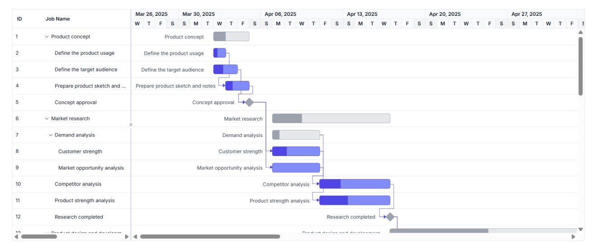
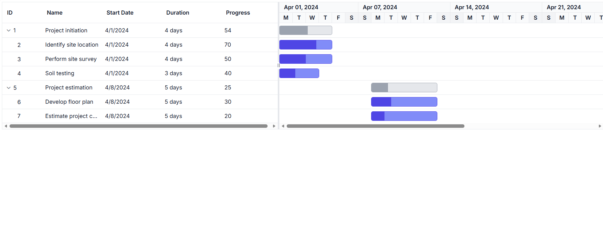

# Getting Started with Vue Gantt Chart in Vue 3

This article provides a step-by-step guide for setting up a [Vite](https://vitejs.dev) project with a JavaScript environment and integrating the [Vue Gantt Chart](https://www.syncfusion.com/vue-components/vue-gantt-chart) component using the [Composition API](https://vuejs.org/guide/introduction.html#composition-api).




## Prerequisites

- [Node.js 24+](https://nodejs.org/en) (LTS recommended).
- Syncfusion CLI.

## Install the Syncfusion CLI 

Install the Syncfusion CLI globally using the following command:



npm install -g @syncfusion/syncfusion-cli



## Set up the Vite project using Syncfusion CLI

You can create a Vue application with [Vite](https://vite.dev/) using the Syncfusion CLI. The CLI provides two ways to create a project:

### Non-interactive mode

Non-interactive mode allows you to create a project directly using a single command with the required command-line arguments.



sf new my-project --framework vue --template gantt



In this mode, the project configuration is passed directly in the command. The above command creates a `Vue` application with Vite and configured it with the Syncfusion<sup style="font-size:70%">&reg;</sup> `Gantt` component. The generated project uses the TypeScript and the Composition API.

### Interactive mode

Interactive mode guides you through the project creation process with step-by-step prompts.



sf



When you run the `sf` command, the CLI prompts you to select the required project configuration options. To create a Vue application with Vite and the Syncfusion<sup style="font-size:70%">&reg;</sup> `Gantt` component, select the following options:




√ Project name? ... my-project
√ Choose Framework: » Vue
√ Choose Language: » JavaScript
√ Choose Template: » Gantt
√ Choose Theme: » Material3
√ Choose Style Format: » CSS
√ Would you like to integrate the Syncfusion MCP Server (AI Assistant) into this project? ... no
√ Would you like to install Syncfusion Component Skills for AI-powered development? ... no      
√ Install dependencies and start app now? ... no




The above selections generate a `Vue` application with Vite and configure it with the Syncfusion<sup style="font-size:70%">&reg;</sup> `Gantt` component. You can choose different values for language, theme, style format, MCP setup, and skills installation based on your project requirements.

The Syncfusion<sup style="font-size:70%">&reg;</sup> CLI creates the project with a predefined template. After the project is generated, you can customize or replace the component code based on your application requirements.

## Run the project

Once the project is created, navigate to the project directory and run the following commands in your terminal.



cd my-project
npm install
npm run dev



The output will appear as follows:







## Prerequisites

Before you begin, make sure that:

- Node.js and npm (or Yarn) are installed.
- Vite and Vue 3 are supported in your environment.
- You are using a supported version of the Syncfusion Vue package for your project.

For compatibility details, see [System requirements for Syncfusion<sup style="font-size:70%">&reg;</sup> Vue UI components](https://ej2.syncfusion.com/vue/documentation/system-requirements).

## Set up the Vite project

A recommended approach for beginning with Vue is to scaffold a project using [Vite](https://vitejs.dev). To create a new Vite project, use one of the commands that are specific to either NPM or Yarn.

```bash
npm create vite@latest
```

or

```bash
yarn create vite
```

Using one of the above commands will lead you to set up additional configurations for the project as below:

1.Define the project name: The name of the project can be specified directly. For this article, the project name is set as `my-project`.

```bash
? Project name: » my-project
```

2.Select `Vue` as the framework. It will create a Vue 3 project.

```bash
? Select a framework: » - Use arrow-keys. Return to submit.
Vanilla
> Vue
  React
  Preact
  Lit
  Svelte
  Others
```

3.Choose `JavaScript` as the framework variant to build this Vite project using JavaScript and Vue.

```bash
? Select a variant: » - Use arrow-keys. Return to submit.
> JavaScript
  TypeScript
  Customize with create-vue ↗
  Nuxt ↗
```

4.Install dependencies and start the development server.

```bash
Install with npm and start now?: Yes
```

Since you selected `Yes`, the development server should start automatically. If you selected `No`, please follow these steps to set up and start the project manually:

```bash
cd my-project
npm install
```

or

```bash
cd my-project
yarn install
```

Now that `my-project` is ready to run with default settings, let's add Syncfusion<sup style="font-size:70%">&reg;</sup> components to the project.

## Add Syncfusion<sup style="font-size:70%">&reg;</sup> Vue packages

Syncfusion<sup style="font-size:70%">&reg;</sup> Vue component packages are available at [npmjs.com](https://www.npmjs.com/search?q=ej2-vue). To use Syncfusion<sup style="font-size:70%">&reg;</sup> Vue components in the project, install the corresponding npm package.

This article uses the [Vue Gantt Chart component](https://www.syncfusion.com/vue-components/vue-gantt-chart) as an example. To use the Vue Gantt Chart component in the project, install the `@syncfusion/ej2-vue-gantt` package using the following command:

```bash
npm install @syncfusion/ej2-vue-gantt
```

or

```bash
yarn add @syncfusion/ej2-vue-gantt
```

## Adding CSS reference

Themes for Syncfusion<sup style="font-size:70%">&reg;</sup> Gantt Chart components can be applied using CSS files provided through [npm theme packages](https://www.npmjs.com/package/@syncfusion/ej2-tailwind3-theme). For available themes, refer to the [Themes](https://ej2.syncfusion.com/vue/documentation/appearance/theme) documentation.

Install the **Tailwind 3** theme package using the following command:




npm install @syncfusion/ej2-tailwind3-theme --save




Then add the following CSS reference to the **src/App.vue** file:




<style>
    @import "../node_modules/@syncfusion/ej2-tailwind3-theme/styles/gantt/index.css";
</style>




## Create sample data

Define a simple task list with hierarchical relationships. Each task must have a `StartDate` and either a `Duration` or `EndDate` to render properly.

```js
const data = [
  {
    TaskID: 1,
    TaskName: "Project initiation",
    StartDate: new Date("2024-04-01"),
    EndDate: new Date("2024-04-15"),
  },
  {
    TaskID: 2,
    TaskName: "Identify site location",
    StartDate: new Date("2024-04-01"),
    Duration: 4,
    Progress: 70,
    ParentID: 1,
  },
  {
    TaskID: 3,
    TaskName: "Perform site survey",
    StartDate: new Date("2024-04-01"),
    Duration: 4,
    Progress: 50,
    ParentID: 1,
  },
  {
    TaskID: 4,
    TaskName: "Soil testing",
    StartDate: new Date("2024-04-01"),
    Duration: 3,
    Progress: 40,
    ParentID: 1,
  },
  {
    TaskID: 5,
    TaskName: "Project estimation",
    StartDate: new Date("2024-04-08"),
    EndDate: new Date("2024-04-18"),
  },
  {
    TaskID: 6,
    TaskName: "Develop floor plan",
    StartDate: new Date("2024-04-08"),
    Duration: 5,
    Progress: 30,
    ParentID: 5,
  },
  {
    TaskID: 7,
    TaskName: "Estimate project cost",
    StartDate: new Date("2024-04-08"),
    Duration: 5,
    Progress: 20,
    ParentID: 5,
  },
];
```

## Configure task fields

```js
const taskFields = {
  id: "TaskID",
  name: "TaskName",
  startDate: "StartDate",
  duration: "Duration",
  progress: "Progress",
  parentID: "ParentID",
};
```

### Field mapping reference

| Property    | Description                        | Required |
| ----------- | ---------------------------------- | -------- |
| `id`        | Unique task identifier             | Yes      |
| `name`      | Task display name                  | Yes      |
| `startDate` | Task start date                    | Yes      |
| `duration`  | Task duration in days              | Yes      |
| `progress`  | Task completion percentage (0-100) | No       |
| `parentID`  | Parent task ID for hierarchy       | No       |

## Render the Gantt Chart component

Replace the default `src/App.vue` content with the following example, or add the sample code to your existing `App.vue` file. Import and register the Gantt Chart component in the `<script>` section, and use the `setup` attribute in the `<script>` tag to enable the Composition API.

To display the Gantt Chart, bind your task data using the `dataSource` property and map the corresponding fields using the `taskFields` property.




<template>
  <ejs-gantt 
    :dataSource="data"
    :taskFields="taskFields"
  >
  </ejs-gantt>
</template>

<script setup>
  // Import and register the Gantt Chart component
  import { GanttComponent as EjsGantt} from '@syncfusion/ej2-vue-gantt';
  const data = [
    {TaskID: 1, TaskName: 'Project initiation', StartDate: new Date('2024-04-01'), EndDate: new Date('2024-04-15')},
    {TaskID: 2, TaskName: 'Identify site location', StartDate: new Date('2024-04-01'), Duration: 4, Progress: 70, ParentID: 1},
    {TaskID: 3, TaskName: 'Perform site survey', StartDate: new Date('2024-04-01'), Duration: 4, Progress: 50, ParentID: 1},
    {TaskID: 4, TaskName: 'Soil testing', StartDate: new Date('2024-04-01'), Duration: 3, Progress: 40, ParentID: 1},
    {TaskID: 5, TaskName: 'Project estimation', StartDate: new Date('2024-04-08'), EndDate: new Date('2024-04-18')},
    {TaskID: 6, TaskName: 'Develop floor plan', StartDate: new Date('2024-04-08'), Duration: 5, Progress: 30, ParentID: 5},
    {TaskID: 7, TaskName: 'Estimate project cost', StartDate: new Date('2024-04-08'), Duration: 5, Progress: 20, ParentID: 5}
  ];
  const taskFields = {
    id: 'TaskID',
    name: 'TaskName',
    startDate: 'StartDate',
    duration: 'Duration',
    progress: 'Progress',
    parentID: 'ParentID'
  };
</script>

<style>
@import "../node_modules/@syncfusion/ej2-base/styles/tailwind3.css";
@import "../node_modules/@syncfusion/ej2-gantt/styles/tailwind3.css";
@import "../node_modules/@syncfusion/ej2-grids/styles/tailwind3.css";
@import "../node_modules/@syncfusion/ej2-treegrid/styles/tailwind3.css";
@import "../node_modules/@syncfusion/ej2-layouts/styles/tailwind3.css";
@import "../node_modules/@syncfusion/ej2-popups/styles/tailwind3.css";
</style>




## Run the application

Run the application using the following command:

```bash
npm run dev
```

The development server usually starts on `http://localhost:5173`. If it does not start, verify that the dependencies were installed successfully and that you are running the command from the project folder.

## Output

You will see a Gantt Chart with:

- Task hierarchy with parent-child relationships
- Timeline view showing task bars
- Progress indicators on each task
- Automatically calculated dates based on duration

The chart displays two parent tasks ("Project initiation" and "Project estimation") with their subtasks shown in a tree structure. Task bars are rendered on the timeline, sized according to their duration and start dates.



Web server will be initiated, Open the quick start app in the browser at port `localhost:8080`.




## Next Steps

- **[Key Elements](./key-elements)** - Learn about UI components and interactions
- **[Feature Modules](./module)** - Enable advanced features with module injection
- **[Overview](./overview)** - Explore all available features
