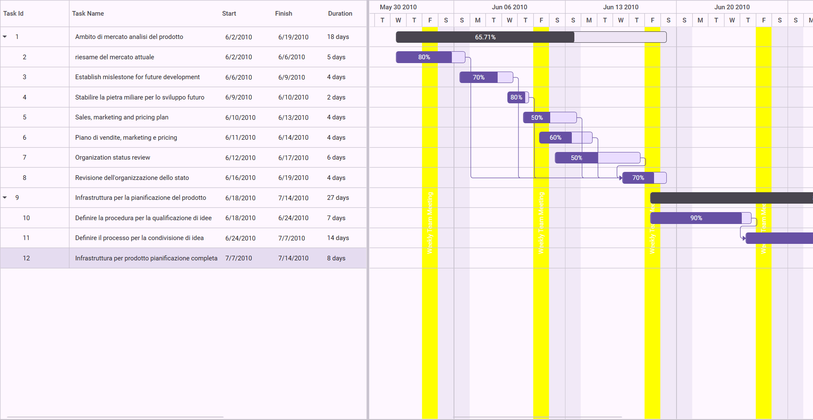
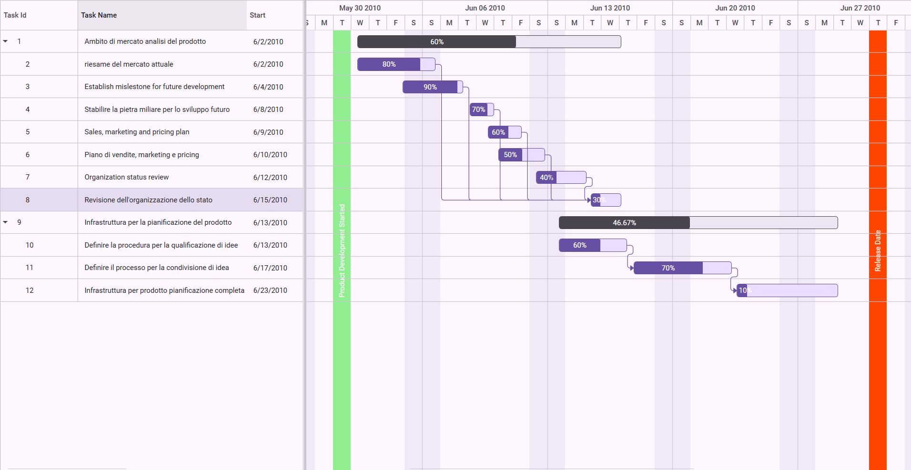

# Strip Lines in WPF Gantt

The control provides support to add strip lines in the Gantt chart region that denote an important event in a sequential timeline. By using this feature, you can add strip lines to highlight the important days in your project. You can add a collection of strip lines using the provided API.

## Strip lines in Essential Gantt support the following features:

Strip lines can be repeatable in the Gantt chart region based on repeat behavior and repeat interval.

* You can modify the content or appearance of the strip lines at run time by changing the values of the underlying collection source.
* The visibility of strip lines can be toggled using the [`ShowStripLines`](https://help.syncfusion.com/cr/wpf/Syncfusion.Windows.Controls.Gantt.GanttControl.html#Syncfusion_Windows_Controls_Gantt_GanttControl_ShowStripLines) property in the Gantt control.

The control will get the information from the application to draw the strip lines. Gantt will accept the strip line information in the form of a collection of `StripLineInfo` objects and process it to draw the strip lines.

### Repeat behavior

The available repeat behaviors are as follows:

* Year
* Month
* Week
* Day
* Hour
* Minute

### Style selector
It used to pass the style of the strip lines dynamically. Based on constraints.
### Template selector
It used to pass the content template of the strip lines dynamically based on constraints.

## Types of strip lines

There are two types of strip lines available in Essential Gantt. They are:

* Regular
* Absolute—Absolute type will place the strip line at any user-defined point. 

## Properties

<table>
<tr>
<th>
Property</th><th>
Description</th><th>
Type</th><th>
Data Type</th></tr>
<tr>
<td>
{{'[Background](https://help.syncfusion.com/cr/wpf/Syncfusion.Windows.Controls.Gantt.StripLineInfo.html#Syncfusion_Windows_Controls_Gantt_StripLineInfo_Background)'| markdownify }}</td><td>
Gets/sets background color of strip line.</td><td>
CLR</td><td>
Brush</td></tr>
<tr>
<td>
{{'[Content](https://help.syncfusion.com/cr/wpf/Syncfusion.Windows.Controls.Gantt.StripLineInfo.html#Syncfusion_Windows_Controls_Gantt_StripLineInfo_Content)'| markdownify }}</td><td>
Gets/sets the content of the strip line.</td><td>
CLR</td><td>
Object</td></tr>
<tr>
<td>
{{'[ContentTemplate](https://help.syncfusion.com/cr/wpf/Syncfusion.Windows.Controls.Gantt.StripLineInfo.html#Syncfusion_Windows_Controls_Gantt_StripLineInfo_ContentTemplate)'| markdownify }}</td><td>
Gets/sets the content template of the strip line.</td><td>
CLR</td><td>
DataTemplate</td></tr>
<tr>
<td>
{{'[ContentTemplateSelector](https://help.syncfusion.com/cr/wpf/Syncfusion.Windows.Controls.Gantt.StripLineInfo.html#Syncfusion_Windows_Controls_Gantt_StripLineInfo_ContentTemplateSelector)'| markdownify }}</td><td>
Gets/sets the TemplateSelector of the strip line.</td><td>
CLR</td><td>
DataTemplateSelector</td></tr>
<tr>
<td>
{{'[StartDate](https://help.syncfusion.com/cr/wpf/Syncfusion.Windows.Controls.Gantt.StripLineInfo.html#Syncfusion_Windows_Controls_Gantt_StripLineInfo_StartDate)'| markdownify }}</td><td>
Gets/sets the start date of the strip line.</td><td>
CLR</td><td>
DateTime</td></tr>
<tr>
<td>
{{'[EndDate](https://help.syncfusion.com/cr/wpf/Syncfusion.Windows.Controls.Gantt.StripLineInfo.html#Syncfusion_Windows_Controls_Gantt_StripLineInfo_EndDate)'| markdownify }}</td><td>
Gets/sets the end date of the strip line.</td><td>
CLR</td><td>
DateTime</td></tr>
<tr>
<td>
{{'[RepeatBehavior](https://help.syncfusion.com/cr/wpf/Syncfusion.Windows.Controls.Gantt.StripLineInfo.html#Syncfusion_Windows_Controls_Gantt_StripLineInfo_RepeatBehavior)'| markdownify }}</td><td>
Gets/sets the repeat behavior of the strip line.</td><td>
CLR</td><td>
Repeat (Enum)</td></tr>
<tr>
<td>
{{'[RepeatFor](https://help.syncfusion.com/cr/wpf/Syncfusion.Windows.Controls.Gantt.StripLineInfo.html#Syncfusion_Windows_Controls_Gantt_StripLineInfo_RepeatFor)'| markdownify }}</td><td>
Gets/sets the intervals between the repeating strip lines.</td><td>
CLR</td><td>
Integer</td></tr>
<tr>
<td>
{{'[RepeatUpto](https://help.syncfusion.com/cr/wpf/Syncfusion.Windows.Controls.Gantt.StripLineInfo.html#Syncfusion_Windows_Controls_Gantt_StripLineInfo_RepeatUpto)'| markdownify }}</td><td>
Gets/sets DateTime value. The strip line will be repeated up to this value.</td><td>
CLR</td><td>
DateTime</td></tr>
<tr>
<td>
{{'[Style](https://help.syncfusion.com/cr/wpf/Syncfusion.Windows.Controls.Gantt.StripLineInfo.html#Syncfusion_Windows_Controls_Gantt_StripLineInfo_Style)'| markdownify }}</td><td>
Gets/sets the style for the strip line.</td><td>
CLR</td><td>
Style</td></tr>
<tr>
<td>
{{'[StyleSelector](https://help.syncfusion.com/cr/wpf/Syncfusion.Windows.Controls.Gantt.StripLineInfo.html#Syncfusion_Windows_Controls_Gantt_StripLineInfo_StyleSelector)'| markdownify }}</td><td>
Gets/sets the style selector of the strip line.</td><td>
CLR</td><td>
StyleSelector</td></tr>
<tr>
<td>
{{'[VerticalContentAlignment](https://help.syncfusion.com/cr/wpf/Syncfusion.Windows.Controls.Gantt.StripLineInfo.html#Syncfusion_Windows_Controls_Gantt_StripLineInfo_VerticalContentAlignment)'| markdownify }}</td><td>
Gets/sets the vertical alignment of the content present in the strip line.</td><td>
CLR</td><td>
VerticalAlignment</td></tr>
<tr>
<td>
{{'[HorizontalContentAlignment](https://help.syncfusion.com/cr/wpf/Syncfusion.Windows.Controls.Gantt.StripLineInfo.html#Syncfusion_Windows_Controls_Gantt_StripLineInfo_HorizontalContentAlignment)'| markdownify }}</td><td>
Gets/sets the horizontal alignment of the content present in the strip line.</td><td>
CLR</td><td>
Horizontal Alignment</td></tr>
<tr>
<td>
{{'[Type](https://help.syncfusion.com/cr/wpf/Syncfusion.Windows.Controls.Gantt.StripLineInfo.html#Syncfusion_Windows_Controls_Gantt_StripLineInfo_Type)'| markdownify }}</td><td>
Gets/sets the type of the strip line.</td><td>
CLR</td><td>
StriplineType(Enum)</td></tr>
<tr>
<td>
{{'[Position](https://help.syncfusion.com/cr/wpf/Syncfusion.Windows.Controls.Gantt.StripLineInfo.html#Syncfusion_Windows_Controls_Gantt_StripLineInfo_Position)'| markdownify }}</td><td>
Gets/sets the absolute position of the strip line for Absolute strip line type.</td><td>
CLR</td><td>
Point</td></tr>
<tr>
<td>
{{'[Height](https://help.syncfusion.com/cr/wpf/Syncfusion.Windows.Controls.Gantt.StripLineInfo.html#Syncfusion_Windows_Controls_Gantt_StripLineInfo_Height)'| markdownify }}</td><td>
Gets/sets the absolute height of the strip line for Absolute strip line type.</td><td>
CLR</td><td>
Double</td></tr>
<tr>
<td>
{{'[Width](https://help.syncfusion.com/cr/wpf/Syncfusion.Windows.Controls.Gantt.StripLineInfo.html#Syncfusion_Windows_Controls_Gantt_StripLineInfo_Width)'| markdownify }}</td><td>
Get/sets the absolute width of the strip line for Absolute strip line type.</td><td>
CLR</td><td>
Double</td></tr>
</table>

### Use Case Scenarios

* You can mark the important dates and meetings in the scheduled time line.
* Strip lines help you to avoid missing important events.

### Properties

<table>
<tr>
<th>
Property</th><th>
Description</th><th>
Type</th><th>
Data Type</th></tr>
<tr>
<td>
{{'[ShowStripLines](https://help.syncfusion.com/cr/wpf/Syncfusion.Windows.Controls.Gantt.GanttControl.html#Syncfusion_Windows_Controls_Gantt_GanttControl_ShowStripLines)'| markdownify }}</td><td>
Get the user option to show the strip lines.</td><td>
Dependency Property</td><td>
Bool</td></tr>
<tr>
<td>
{{'[StripLines](https://help.syncfusion.com/cr/wpf/Syncfusion.Windows.Controls.Gantt.GanttControl.html#Syncfusion_Windows_Controls_Gantt_GanttControl_StripLines)'| markdownify }}</td><td>
Get/sets the collection of StripLineInfo from the user.</td><td>
Dependency Property</td><td>
IEnumerable</td></tr>
</table>

### Enums

<table>
<tr>
<th>
Property</th><th>
Description</th></tr>
<tr>
<td>
{{'[Repeat](https://help.syncfusion.com/cr/wpf/Syncfusion.Windows.Controls.Gantt.Repeat.html)'| markdownify }}</td><td>
This property contains the following values:Year: Repeating the strip line on a yearly basis depends on the RepeatFor value in StripLineInfo.Month: Repeating the strip line on a monthly basis depends on the RepeatFor value in StripLineInfo.Week: Repeating the strip line on a weekly basis depends on the RepeatFor value in StripLineInfo.Day: Repeating the strip line on a daily basis depends on the RepeatFor value in StripLineInfo.Hour: Repeating the strip line on an hourly basis depends on the RepeatFor value in StripLineInfo.Minute: Repeating the strip line on per-minute basis depends on the RepeatFor value in StripLineInfo.</td></tr>
<tr>
<td>
{{'[StriplineType](https://help.syncfusion.com/cr/wpf/Syncfusion.Windows.Controls.Gantt.StriplineType.html#fields)'| markdownify }}</td><td>
This property contains the following values:Regular: This denotes the normal strip line.Absolute: This denotes the absolute strip line. You can customize the position, size, and appearance of the strip line in this type.</td></tr>
</table>

### Events

By handling its event, you can customize the strip lines dynamically.

<table>
<tr>
<th>
Event</th><th>
Description</th><th>
Arguments</th><th>
Type</th></tr>
<tr>
<td>
{{'[StripLineCreated](https://help.syncfusion.com/cr/wpf/Syncfusion.Windows.Controls.Gantt.GanttControl.html#Syncfusion_Windows_Controls_Gantt_GanttControl_StripLineCreated)'| markdownify }}</td><td>
Whenever a strip line is created, this event will be triggered. the handler of the event will have the newly created strip line (StripLineInfo) in the argument.By handling this event, you can customize the appearance of the strip line.</td><td>
StripLineCreated(object sender, StriplineCreatedEventArgs args)</td><td>
Event </td></tr>
</table>

## Adding strip lines to application

### Regular strip lines

The following code sample demonstrates how to bind the regular strip line collection to strip lines.




<syncfusion:GanttControl x:Name="ganttControl"
                         ShowStripLines="True"
                         ItemsSource="{Binding TaskCollection}"
                         StripLines="{Binding RegularStripLines}">
    <syncfusion:GanttControl.TaskAttributeMapping>
        <syncfusion:TaskAttributeMapping TaskIdMapping="TaskId"
                                         TaskNameMapping="TaskName"
                                         StartDateMapping="StartDate"
                                         ChildMapping="Child"
                                         FinishDateMapping="FinishDate"
                                         DurationMapping="Duration"
                                         ProgressMapping="Progress"
                                         PredecessorMapping="Predecessor"
                                         ResourceInfoMapping="Resources"/>
    </syncfusion:GanttControl.TaskAttributeMapping>
    <syncfusion:GanttControl.DataContext>
        <local:ViewModel/>
    </syncfusion:GanttControl.DataContext>
</syncfusion:GanttControl>     





this.ganttControl.ItemsSource = new ViewModel().TaskCollection;
this.ganttControl.ShowStripLines = true;

// Task attribute mapping
TaskAttributeMapping taskAttributeMapping = new TaskAttributeMapping();
taskAttributeMapping.TaskIdMapping = "TaskId";
taskAttributeMapping.TaskNameMapping = "TaskName";
taskAttributeMapping.StartDateMapping = "StartDate";
taskAttributeMapping.ChildMapping = "Child";
taskAttributeMapping.FinishDateMapping = "FinishDate";
taskAttributeMapping.DurationMapping = "Duration";
taskAttributeMapping.MileStoneMapping = "IsMileStone";
taskAttributeMapping.PredecessorMapping = "Predecessor";
taskAttributeMapping.ProgressMapping = "Progress";
taskAttributeMapping.ResourceInfoMapping = "Resource";
this.ganttControl.TaskAttributeMapping = taskAttributeMapping;

List<StripLineInfo> stripCollection = new List<StripLineInfo>();

//Getting the collection of StripLineInfo
stripCollection = GetStripCollection();

//Property for strip collection.
public List<StripLineInfo> StripCollection
{
    get
    {
        return this.stripCollection;
    }
    set
    {
        this.stripCollection = value;
        RaisePropertyChanged("StripCollection");
    }
}

//Method will return the collection StripLineInfo
private List<StripLineInfo> GetStripCollection()
{
    this.stripCollection.Add(new StripLineInfo() 
    { 
        Content =  "Weekly Team Meeting", 
        StartDate = new DateTime(2012, 6, 4), 
        EndDate = new DateTime(2012, 6, 4), 
        HorizontalContentAlignment = HorizontalAlignment.Center, 
        VerticalContentAlignment = VerticalAlignment.Center, 
        Background =  Brushes.Gold, RepeatBehavior = Repeat.Week, RepeatFor = 1,
        RepeatUpto = new DateTime(2012, 12, 10),
    });

    return this.stripCollection;
}

 

 

    class ViewModel
{
    public ViewModel()
    {
        _taskCollection = this.GetData();
        LoadRegularStripLines();
    }

    private ObservableCollection<TaskDetails> _taskCollection;

    /// 

    /// Gets or sets the appointment item source.
    /// 

    /// <value>The appointment item source.</value>
    public ObservableCollection<TaskDetails> TaskCollection
    {
        get
        {
            return _taskCollection;
        }
        set
        {
            _taskCollection = value;
        }
    }

    public ObservableCollection<StripLineInfo> RegularStripLines
    {
        get;
        set;
    }

    private void LoadRegularStripLines()
    {
        RegularStripLines = new ObservableCollection<StripLineInfo>()
        {
            new StripLineInfo()
            {
                Content = "Weekly Team Meeting",
                StartDate = new DateTime(2010, 6, 4, 0, 0, 0),
                EndDate = new DateTime(2010, 6, 4, 23, 59, 59),

                Background = Brushes.Yellow,

                RepeatBehavior = Repeat.Week,
                RepeatFor = 1,
                RepeatUpto = new DateTime(2010, 12, 31),

                HorizontalContentAlignment = HorizontalAlignment.Center,
                VerticalContentAlignment = VerticalAlignment.Center
            }
        };
    }

    /// 

    /// Gets the data.
    /// 

    /// <returns></returns>
    public ObservableCollection<TaskDetails> GetData()
    {
        ObservableCollection<TaskDetails> Activities = new ObservableCollection<TaskDetails>();

        Activities.Add(new TaskDetails { StartDate = new DateTime(2010, 6, 2), FinishDate = new DateTime(2010, 6, 18), TaskName = "Ambito di mercato analisi del prodotto", TaskId = 1 });

        ObservableCollection<IGanttTask> MarketAnalysis = new ObservableCollection<IGanttTask>();
        MarketAnalysis.Add(new TaskDetails { StartDate = new DateTime(2010, 6, 2), FinishDate = new DateTime(2010, 6, 6), TaskName = "riesame del mercato attuale", TaskId = 2 });
        MarketAnalysis.Add(new TaskDetails { StartDate = new DateTime(2010, 6, 6), FinishDate = new DateTime(2010, 6, 9), TaskName = "Establish mislestone for future development", TaskId = 3 });
        MarketAnalysis.Add(new TaskDetails { StartDate = new DateTime(2010, 6, 9), FinishDate = new DateTime(2010, 6, 10), TaskName = "Stabilire la pietra miliare per lo sviluppo futuro", TaskId = 4 });
        MarketAnalysis.Add(new TaskDetails { StartDate = new DateTime(2010, 6, 10), FinishDate = new DateTime(2010, 6, 13), TaskName = "Sales, marketing and pricing plan", TaskId = 5 });
        MarketAnalysis.Add(new TaskDetails { StartDate = new DateTime(2010, 6, 11), FinishDate = new DateTime(2010, 6, 14), TaskName = "Piano di vendite, marketing e pricing", TaskId = 6 });
        MarketAnalysis.Add(new TaskDetails { StartDate = new DateTime(2010, 6, 12), FinishDate = new DateTime(2010, 6, 17), TaskName = "Organization status review", TaskId = 7 });
        MarketAnalysis.Add(new TaskDetails { StartDate = new DateTime(2010, 6, 18), FinishDate = new DateTime(2010, 6, 18), TaskName = "Revisione dell'organizzazione dello stato", TaskId = 8 });
        ObservableCollection<Predecessor> mrkPredecessor = new ObservableCollection<Predecessor>();
        mrkPredecessor.Add(new Predecessor { GanttTaskIndex = 2, GanttTaskRelationship = GanttTaskRelationship.FinishToStart });
        mrkPredecessor.Add(new Predecessor { GanttTaskIndex = 3, GanttTaskRelationship = GanttTaskRelationship.FinishToStart });
        mrkPredecessor.Add(new Predecessor { GanttTaskIndex = 4, GanttTaskRelationship = GanttTaskRelationship.FinishToStart });
        mrkPredecessor.Add(new Predecessor { GanttTaskIndex = 5, GanttTaskRelationship = GanttTaskRelationship.FinishToStart });
        mrkPredecessor.Add(new Predecessor { GanttTaskIndex = 6, GanttTaskRelationship = GanttTaskRelationship.FinishToStart });
        mrkPredecessor.Add(new Predecessor { GanttTaskIndex = 7, GanttTaskRelationship = GanttTaskRelationship.FinishToStart });
        MarketAnalysis[6].Predecessor = mrkPredecessor;

        Activities[0].Child = MarketAnalysis;

        Activities.Add(new TaskDetails { StartDate = new DateTime(2010, 6, 18), FinishDate = new DateTime(2010, 7, 14), TaskName = "Infrastruttura per la pianificazione del prodotto", TaskId = 9 });
        ObservableCollection<IGanttTask> InfrastructureReq = new ObservableCollection<IGanttTask>();
        InfrastructureReq.Add(new TaskDetails { StartDate = new DateTime(2010, 6, 18), FinishDate = new DateTime(2010, 6, 24), TaskName = "Definire la procedura per la qualificazione di idee", TaskId = 10 });
        InfrastructureReq.Add(new TaskDetails { StartDate = new DateTime(2010, 6, 24), FinishDate = new DateTime(2010, 7, 7), TaskName = "Definire il processo per la condivisione di idea", TaskId = 11 });
        InfrastructureReq.Add(new TaskDetails { StartDate = new DateTime(2010, 7, 7), FinishDate = new DateTime(2010, 7, 14), TaskName = "Infrastruttura per prodotto pianificazione completa", TaskId = 12 });
        InfrastructureReq[1].Predecessor.Add(new Predecessor { GanttTaskIndex = 10, GanttTaskRelationship = GanttTaskRelationship.FinishToStart });
        InfrastructureReq[2].Predecessor.Add(new Predecessor { GanttTaskIndex = 11, GanttTaskRelationship = GanttTaskRelationship.FinishToStart });

        Activities[1].Child = InfrastructureReq;

        return Activities;
    }
}




### Output

The following screenshot illustrates how to render the regular strip lines.

Strip lines in the Gantt chart
{:.caption}

### Absolute Strip lines

The following code sample demonstrates how to bind the absolute strip line collection to strip lines.




<syncfusion:GanttControl x:Name="ganttControl"
                         ShowStripLines="True"
                         ItemsSource="{Binding TaskCollection}"
                         StripLines="{Binding AbsoluteStripLines}">
    <syncfusion:GanttControl.TaskAttributeMapping>
        <syncfusion:TaskAttributeMapping TaskIdMapping="TaskId"
                                         TaskNameMapping="TaskName"
                                         StartDateMapping="StartDate"
                                         FinishDateMapping="FinishDate"
                                         ChildMapping="Child"
                                         DurationMapping="Duration"
                                         ProgressMapping="Progress"
                                         PredecessorMapping="Predecessor"
                                         ResourceInfoMapping="Resources"/>
    </syncfusion:GanttControl.TaskAttributeMapping>
     <syncfusion:GanttControl.DataContext>
        <local:ViewModel/>
    </syncfusion:GanttControl.DataContext>
</syncfusion:GanttControl>                                                 





this.ganttControl.ItemsSource = new ViewModel().TaskCollection;
this.ganttControl.ShowStripLines = true;

// Task attribute mapping
TaskAttributeMapping taskAttributeMapping = new TaskAttributeMapping();
taskAttributeMapping.TaskIdMapping = "TaskId";
taskAttributeMapping.TaskNameMapping = "TaskName";
taskAttributeMapping.StartDateMapping = "StartDate";
taskAttributeMapping.ChildMapping = "Child";
taskAttributeMapping.FinishDateMapping = "FinishDate";
taskAttributeMapping.DurationMapping = "Duration";
taskAttributeMapping.MileStoneMapping = "IsMileStone";
taskAttributeMapping.PredecessorMapping = "Predecessor";
taskAttributeMapping.ProgressMapping = "Progress";
taskAttributeMapping.ResourceInfoMapping = "Resource";
this.ganttControl.TaskAttributeMapping = taskAttributeMapping;

List<StripLineInfo> stripCollection = new List<StripLineInfo>();

//Getting the collection of StripLineInfo
stripCollection = GetStripCollection();

//Property for strip collection.
public List<StripLineInfo> StripCollection
{
    get
    {
        return this.stripCollection;
    }
    set
    {
        this.stripCollection = value;
        RaisePropertyChanged("StripCollection");
    }
}

//Method will return the collection StripLineInfo
private List<StripLineInfo> GetStripCollection()
{
    this.stripCollection.Add(new StripLineInfo() 
    { 
        Content =  "Weekly Team Meeting", 
        StartDate = new DateTime(2012, 6, 4), 
        EndDate = new DateTime(2012, 6, 4), 
        HorizontalContentAlignment = HorizontalAlignment.Center, 
        VerticalContentAlignment = VerticalAlignment.Center, 
        Background =  Brushes.Gold, RepeatBehavior = Repeat.Week, RepeatFor = 1,
        RepeatUpto = new DateTime(2012, 12, 10),
    });

    return this.stripCollection;
}





public class ViewModel
{
    public ViewModel()
    {
        _taskCollection = this.GetData();
        LoadAbsoluteStripLines();
    }

    private ObservableCollection<TaskDetails> _taskCollection;

    /// 

    /// Gets or sets the appointment item source.
    /// 

    /// <value>The appointment item source.</value>
    public ObservableCollection<TaskDetails> TaskCollection
    {
        get
        {
            return _taskCollection;
        }
        set
        {
            _taskCollection = value;
        }
    }

    public ObservableCollection<StripLineInfo> AbsoluteStripLines
    {
        get;
        set;
    }

    private void LoadAbsoluteStripLines()
    {
        AbsoluteStripLines = new ObservableCollection<StripLineInfo>()
        {
            new StripLineInfo()
            {
                Content = "Product Development Started",
                StartDate = new DateTime(2010, 6, 1, 0, 0, 0),
                EndDate = new DateTime(2010, 6, 1, 23, 59, 59),
                Background = Brushes.LightGreen,
                HorizontalContentAlignment = HorizontalAlignment.Center,
                VerticalContentAlignment = VerticalAlignment.Center
            },

            new StripLineInfo()
            {
                Content = "Release Date",
                StartDate = new DateTime(2010, 7, 1, 0, 0, 0),
                EndDate = new DateTime(2010, 7, 1, 23, 59, 59),
                Background = Brushes.OrangeRed,
                HorizontalContentAlignment = HorizontalAlignment.Center,
                VerticalContentAlignment = VerticalAlignment.Center
            }
        };
    }

    /// 

    /// Gets the data.
    /// 

    /// <returns></returns>
    public ObservableCollection<TaskDetails> GetData()
    {
        ObservableCollection<TaskDetails> Activities = new ObservableCollection<TaskDetails>();

        Activities.Add(new TaskDetails { StartDate = new DateTime(2010, 6, 2), FinishDate = new DateTime(2010, 6, 18), TaskName = "Ambito di mercato analisi del prodotto", TaskId = 1 });

        ObservableCollection<IGanttTask> MarketAnalysis = new ObservableCollection<IGanttTask>();
        MarketAnalysis.Add(new TaskDetails { StartDate = new DateTime(2010, 6, 2), FinishDate = new DateTime(2010, 6, 6), TaskName = "riesame del mercato attuale", TaskId = 2 });
        MarketAnalysis.Add(new TaskDetails { StartDate = new DateTime(2010, 6, 6), FinishDate = new DateTime(2010, 6, 9), TaskName = "Establish mislestone for future development", TaskId = 3 });
        MarketAnalysis.Add(new TaskDetails { StartDate = new DateTime(2010, 6, 9), FinishDate = new DateTime(2010, 6, 10), TaskName = "Stabilire la pietra miliare per lo sviluppo futuro", TaskId = 4 });
        MarketAnalysis.Add(new TaskDetails { StartDate = new DateTime(2010, 6, 10), FinishDate = new DateTime(2010, 6, 13), TaskName = "Sales, marketing and pricing plan", TaskId = 5 });
        MarketAnalysis.Add(new TaskDetails { StartDate = new DateTime(2010, 6, 11), FinishDate = new DateTime(2010, 6, 14), TaskName = "Piano di vendite, marketing e pricing", TaskId = 6 });
        MarketAnalysis.Add(new TaskDetails { StartDate = new DateTime(2010, 6, 12), FinishDate = new DateTime(2010, 6, 17), TaskName = "Organization status review", TaskId = 7 });
        MarketAnalysis.Add(new TaskDetails { StartDate = new DateTime(2010, 6, 18), FinishDate = new DateTime(2010, 6, 18), TaskName = "Revisione dell'organizzazione dello stato", TaskId = 8 });
        ObservableCollection<Predecessor> mrkPredecessor = new ObservableCollection<Predecessor>();
        mrkPredecessor.Add(new Predecessor { GanttTaskIndex = 2, GanttTaskRelationship = GanttTaskRelationship.FinishToStart });
        mrkPredecessor.Add(new Predecessor { GanttTaskIndex = 3, GanttTaskRelationship = GanttTaskRelationship.FinishToStart });
        mrkPredecessor.Add(new Predecessor { GanttTaskIndex = 4, GanttTaskRelationship = GanttTaskRelationship.FinishToStart });
        mrkPredecessor.Add(new Predecessor { GanttTaskIndex = 5, GanttTaskRelationship = GanttTaskRelationship.FinishToStart });
        mrkPredecessor.Add(new Predecessor { GanttTaskIndex = 6, GanttTaskRelationship = GanttTaskRelationship.FinishToStart });
        mrkPredecessor.Add(new Predecessor { GanttTaskIndex = 7, GanttTaskRelationship = GanttTaskRelationship.FinishToStart });
        MarketAnalysis[6].Predecessor = mrkPredecessor;

        Activities[0].Child = MarketAnalysis;

        Activities.Add(new TaskDetails { StartDate = new DateTime(2010, 6, 18), FinishDate = new DateTime(2010, 7, 14), TaskName = "Infrastruttura per la pianificazione del prodotto", TaskId = 9 });
        ObservableCollection<IGanttTask> InfrastructureReq = new ObservableCollection<IGanttTask>();
        InfrastructureReq.Add(new TaskDetails { StartDate = new DateTime(2010, 6, 18), FinishDate = new DateTime(2010, 6, 24), TaskName = "Definire la procedura per la qualificazione di idee", TaskId = 10 });
        InfrastructureReq.Add(new TaskDetails { StartDate = new DateTime(2010, 6, 24), FinishDate = new DateTime(2010, 7, 7), TaskName = "Definire il processo per la condivisione di idea", TaskId = 11 });
        InfrastructureReq.Add(new TaskDetails { StartDate = new DateTime(2010, 7, 7), FinishDate = new DateTime(2010, 7, 14), TaskName = "Infrastruttura per prodotto pianificazione completa", TaskId = 12 });
        InfrastructureReq[1].Predecessor.Add(new Predecessor { GanttTaskIndex = 10, GanttTaskRelationship = GanttTaskRelationship.FinishToStart });
        InfrastructureReq[2].Predecessor.Add(new Predecessor { GanttTaskIndex = 11, GanttTaskRelationship = GanttTaskRelationship.FinishToStart });

        Activities[1].Child = InfrastructureReq;

        return Activities;
    }
}




### Output

The following screenshot illustrates how to render the absolute strip lines.

Strip lines in the Gantt chart
{:.caption}

### Sample Link

To view samples:

1. Go to the Syncfusion Essential Studio installed location. 
    Location: Installed Location\Syncfusion\Essential Studio\{{ site.releaseversion }}\Infrastructure\Launcher\Syncfusion Control Panel 
2. Open the Syncfusion Control Panel in the above location (or) Double click on the Syncfusion Control Panel desktop shortcut menu.
3. Click Run Samples for WPF under the User Interface Edition panel.
4. Select Gantt.
5. Expand the Interactive Features item in the Sample Browser.
6. Choose the Strip Lines sample to launch.

## see also

[How to enable horizontal lines for gantt chart rows](https://support.syncfusion.com/kb/article/3380/how-to-enable-horizontal-lines-for-ganttcharts-rows)